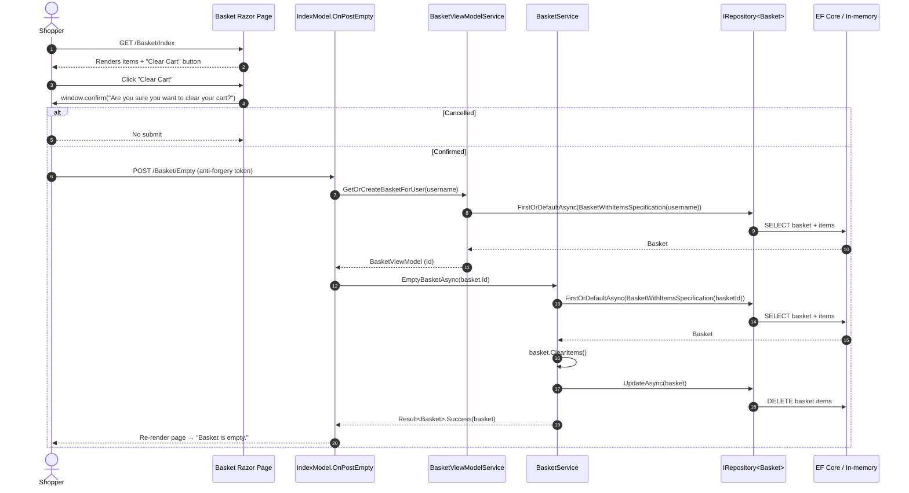

# Clear Cart Button — Implementation Plan

> **For Agent:** Execute this plan task-by-task. Follow each step exactly, verify test results before proceeding, and commit after each task.
> **TDD Rule:** No production code without a failing test first.

**Goal:** Add a "Clear Cart" button on the basket page that, after a confirmation prompt, removes all items from the shopper's current basket.
**Architecture:** Extend the `Basket` aggregate with a `ClearItems()` method, add `IBasketService.EmptyBasketAsync(int basketId)` implemented against the existing repository + specification, and expose it through a new `OnPostEmpty` handler on the basket Razor Page. The page renders a small separate `<form>` with a client-side `confirm(...)` prompt, shown only when the basket has items.
**Tech Stack:** C# / .NET 10, ASP.NET Core Razor Pages, Ardalis.Specification, Ardalis.Result, xUnit v3 + NSubstitute, Reqnroll + MSTest (BDD).
**Complexity Path:** `E2E path` — user-facing UI with multi-layer changes (domain → service → page → BDD), confirmed by research Q&A.
**Status:** Complete

## Execution Log

### Batch 1 — Phases 1–2 (complete, 2026-04-19)
- **Task 1** ✅ `Basket.ClearItems()` — `BasketClearItems` tests (2/2 pass). Commit `26629c4`.
  - Deviation: test placed under `tests/UnitTests/ApplicationCore/Entities/BasketTests/BasketClearItems.cs` (matching existing `BasketRemoveEmptyItems.cs` convention) instead of plan's `BasketAggregate/BasketClearItemsTests.cs`. Same namespace style, same behavioral coverage.
- **Task 2** ✅ `IBasketService.EmptyBasketAsync` + service impl — `EmptyBasket` tests (2/2 pass). Commit `da5f29f`.
- **Task 3** ✅ `ReturnsNotFoundWhenBasketMissing` — passes without additional prod code (Task 2 guard already returns `NotFound`). Commit `872dba1`.
  - Deviation: plan suggested "skip COMMIT" when covered-by-Task-2; committed as test-only per plan's alternative message (`test(basket): cover NotFound path for EmptyBasketAsync`) so the regression guard is captured in history rather than left uncommitted.
- Verification: `dotnet test tests/UnitTests/UnitTests.csproj` → 48/48 pass post-Task-2; 49/49 pass post-Task-3.

### Batch 2 — Phases 3–5 (complete, 2026-04-19)
- **Task 4** ✅ `IndexModel.OnPostEmpty` + BDD "Clearing the cart removes all items" — Reqnroll generates `BasketWebPagesFeature` class; filter updated to `FullyQualifiedName~BasketWebPagesFeature` (plan's `BasketFeature` was a near-miss). `ClearingTheCartRemovesAllItems` scenario pass; refactor reused `userName` local. Commit `23bd150`.
- **Task 5** ✅ Clear Cart button + JS confirm — separate `<form asp-page-handler="Empty">` inside the `@if (Items.Any())` block. "Clear Cart button appears when the basket has items" + "Clear Cart button is not shown for an empty basket" both pass. Commit `cab58b0`.
- **Task 6** ✅ Full regression — `dotnet build eShopOnWeb.sln` 0 errors / 157 warnings (all pre-existing vuln/style warnings; my changes introduced none new). `dotnet test eShopOnWeb.sln` → UnitTests 49/49, IntegrationTests 3/3, WebTests 28/28, PublicApiTests 95/95 — all pass.

## Deviations Summary
1. Unit test file path/name: `Entities/BasketTests/BasketClearItems.cs` (matches existing sibling `BasketRemoveEmptyItems.cs`) rather than the plan's `Entities/BasketAggregate/BasketClearItemsTests.cs`.
2. Task 3 test was committed (regression guard) instead of skipped — used the plan's alternative commit message.
3. BDD test filter uses `BasketWebPagesFeature` (Reqnroll's generated class name) rather than the plan's `BasketFeature`.
4. **Layout fix (post-review, commit `d5a86ee`):** the plan's "separate `<form>`" mitigation (Task 5 Risks) caused the Clear Cart button to render on a new row (each `<form>` is block-level). Merged the Clear Cart button into the existing Update/Checkout form using `asp-page-handler="Empty"` on the button (which emits `formaction` pointing at `/Basket/Empty`) and moved the `confirm` prompt to the button's `onclick` so only Clear Cart is gated, not Update. The plan's stated risk — "posted `Items[]` collide with the Empty handler" — does not apply because `OnPostEmpty()` has no bound parameters; unbound form fields are harmlessly ignored. All 16 Basket BDD scenarios still pass; the `return confirm(` substring remains in the rendered HTML via the button's `onclick` attribute.


---

## Context

Shoppers on `/Basket/Index` today can only empty the basket by setting every item's quantity to `0` and pressing **Update** — tedious when the cart has several items. The requested change adds a single "Clear Cart" action that removes every item in one step and asks for confirmation before doing so, preventing accidental loss of a shopper's selections. No change to checkout, anonymous/authenticated basket transfer, or buyer linkage is in scope: we empty the basket's items but keep the `Basket` row so the cookie-bound anonymous shopper keeps the same `BuyerId`.

Research (`/research` output, 2026-04-19) confirmed with the user:
- Confirmation: **client-side `confirm(...)`**.
- Data semantics: **empty items, keep the Basket row**.
- Placement: **next to Update / Checkout**, only rendered when items exist.
- Tests: **unit tests for the new service method** + **Reqnroll BDD scenarios**.

---

## Requirements

### User Stories
- As a shopper, I want a "Clear Cart" button on the basket page so I can remove all items at once instead of updating each quantity to zero.
- As a shopper, I want the button to ask for confirmation before clearing so I don't lose my selections by mistake.

### Acceptance Criteria
- Given a basket with two or more items, when the shopper submits the Clear Cart form, then the basket page shows "Basket is empty." and no item rows.
- Given a basket with zero items, when the shopper visits `/Basket/Index`, then the "Clear Cart" button is **not** rendered.
- Given a basket with one or more items, when the shopper visits `/Basket/Index`, then the "Clear Cart" button is rendered and its form uses `onsubmit="return confirm(...)"` so a browser prompt fires before submission.
- Given an anonymous shopper clears their cart, when they add a new item afterwards, then the same cookie-bound basket (same `BuyerId`) is reused — no orphaned baskets.

### Assumptions, Constraints, and Scope Boundaries
- No database schema change. EF Core migrations are untouched.
- `ApplicationCore` keeps zero infrastructure dependencies (CLAUDE.md constraint).
- File-scoped namespaces, 4-space indent, `_camelCase` private fields, Guard clauses — match existing `BasketService` style.
- Confirmation is JS-only. Users with JavaScript disabled will not see the prompt — deemed acceptable because the action is idempotent and easily reversible by re-adding items (matches the decision in the research phase).
- The `Success` and `Checkout` pages are out of scope.
- `Result<Basket>` is used for the new service method to mirror `SetQuantities` (existing pattern).

---

## Architecture Review

### Reusable components (reuse, do not recreate)
- `Microsoft.eShopWeb.ApplicationCore.Specifications.BasketWithItemsSpecification(int basketId)` — already used by `BasketService.SetQuantities`.
- `Microsoft.eShopWeb.ApplicationCore.Entities.BasketAggregate.Basket` (aggregate root) — owns mutation (`AddItem`, `RemoveEmptyItems`); the new `ClearItems()` belongs here.
- `Ardalis.Result<Basket>` return shape and the `NotFound` factory — already used by `SetQuantities`.
- `Microsoft.eShopWeb.Web.Pages.Basket.IndexModel.GetOrSetBasketCookieAndUserName()` — reuse as the buyer-resolution source for the new handler.
- `IBasketViewModelService.GetOrCreateBasketForUser(string)` and `Map(Basket)` — used by the new handler to re-render the page model.
- `tests/WebTests/Support/WebPageHelpers.GetRequestVerificationToken` and the `BasketSteps` binding class — reuse for the new Reqnroll steps.
- `tests/UnitTests/ApplicationCore/Services/BasketServiceTests/DeleteBasket.cs` — fixture template for the new `EmptyBasket.cs` test class.

### Affected layers & data flow
`POST /Basket/Empty` → `IndexModel.OnPostEmpty` (`src/Web/Pages/Basket/Index.cshtml.cs`)
→ resolves `username` via `GetOrSetBasketCookieAndUserName()`
→ `IBasketViewModelService.GetOrCreateBasketForUser(username)` to obtain `basketId`
→ `IBasketService.EmptyBasketAsync(basketId)` (`src/ApplicationCore/Services/BasketService.cs`)
→ loads `Basket` via `BasketWithItemsSpecification(basketId)`, calls `basket.ClearItems()`, `UpdateAsync`
→ returns `Result<Basket>` (`NotFound` if missing).

The page is re-rendered (no redirect) — matches the existing `OnPostUpdate` pattern.

### Mermaid user journey



### Files that will change
- **Modify**: `src/ApplicationCore/Entities/BasketAggregate/Basket.cs` — add `ClearItems()`.
- **Modify**: `src/ApplicationCore/Interfaces/IBasketService.cs` — add `EmptyBasketAsync`.
- **Modify**: `src/ApplicationCore/Services/BasketService.cs` — implement `EmptyBasketAsync`.
- **Modify**: `src/Web/Pages/Basket/Index.cshtml.cs` — add `OnPostEmpty` handler.
- **Modify**: `src/Web/Pages/Basket/Index.cshtml` — render separate Clear Cart `<form>` with JS `confirm`.
- **Create**: `tests/UnitTests/ApplicationCore/Services/BasketServiceTests/EmptyBasket.cs`.
- **Create**: `tests/UnitTests/ApplicationCore/Entities/BasketAggregate/BasketClearItemsTests.cs`.
- **Modify**: `tests/WebTests/Features/Basket.feature` — new scenarios.
- **Modify**: `tests/WebTests/StepDefinitions/BasketSteps.cs` — new step binding.

### Common test commands (used throughout)
- Unit tests (class filter): `dotnet test tests/UnitTests/UnitTests.csproj --filter "FullyQualifiedName~BasketServiceTests.EmptyBasket"`
- Unit tests (whole project): `dotnet test tests/UnitTests/UnitTests.csproj`
- BDD Basket feature: `dotnet test tests/WebTests/WebTests.csproj --filter "FullyQualifiedName~BasketFeature"`
- BDD Basket (by scenario): `dotnet test tests/WebTests/WebTests.csproj --filter "DisplayName~<scenario name>"`
- Whole solution: `dotnet test eShopOnWeb.sln --verbosity normal`

---

## Implementation Steps

### Phase 1: Domain — `Basket.ClearItems()`

#### Task 1: `ClearItems` removes every item from the basket
**Goal:** Prove the `Basket` aggregate exposes a `ClearItems()` method that empties its `Items` collection.

**Files:**
- Modify: `src/ApplicationCore/Entities/BasketAggregate/Basket.cs`
- Test: `tests/UnitTests/ApplicationCore/Entities/BasketAggregate/BasketClearItemsTests.cs` (new)

**RED - Write Failing Test**
Create `tests/UnitTests/ApplicationCore/Entities/BasketAggregate/BasketClearItemsTests.cs`:

```csharp
using Microsoft.eShopWeb.ApplicationCore.Entities.BasketAggregate;
using Xunit;

namespace Microsoft.eShopWeb.UnitTests.ApplicationCore.Entities.BasketAggregate;

public class BasketClearItemsTests
{
    private readonly string _buyerId = "Test buyerId";

    [Fact]
    public void RemovesAllItems()
    {
        var basket = new Basket(_buyerId);
        basket.AddItem(1, 1.1m, 1);
        basket.AddItem(2, 2.2m, 3);

        basket.ClearItems();

        Assert.Empty(basket.Items);
    }

    [Fact]
    public void OnEmptyBasketIsNoOp()
    {
        var basket = new Basket(_buyerId);

        basket.ClearItems();

        Assert.Empty(basket.Items);
    }
}
```

**Requirements:**
- One behavior per test
- Clear name
- Real aggregate, no mocks

**Verify RED - Watch It Fail**
Run: `dotnet test tests/UnitTests/UnitTests.csproj --filter "FullyQualifiedName~BasketClearItemsTests"`

Confirm:
- Test fails with a compile error: `'Basket' does not contain a definition for 'ClearItems'`
- Failure is because the method is missing (not typos)

**Test passes?** You're testing existing behavior. Fix test.

**Test errors?** Expected — a compile error counts as RED here because it proves `ClearItems` is not yet defined. Proceed to GREEN only if the error names `ClearItems`.

**GREEN - Minimal Code**
Add to `src/ApplicationCore/Entities/BasketAggregate/Basket.cs`, below `RemoveEmptyItems`:

```csharp
    public void ClearItems()
    {
        _items.Clear();
    }
```

Don't add features, refactor other code, or "improve" beyond the test.

**Verify GREEN - Watch It Pass**
Run: `dotnet test tests/UnitTests/UnitTests.csproj --filter "FullyQualifiedName~BasketClearItemsTests"`

Confirm:
- Both tests pass
- Other tests still pass: `dotnet test tests/UnitTests/UnitTests.csproj`
- Output pristine (no errors, warnings)

**Test fails?** Fix code, not test.

**Other tests fail?** Fix now.

**REFACTOR - Clean Up**
No duplication to remove. Confirm the method is alphabetically/functionally grouped near other mutators (`AddItem`, `RemoveEmptyItems`). No further refactor needed.

**Verify GREEN - Stay Green After Refactor**
Run: `dotnet test tests/UnitTests/UnitTests.csproj`

Confirm:
- All unit tests green
- Output pristine

**COMMIT**
Run:
```
git add src/ApplicationCore/Entities/BasketAggregate/Basket.cs tests/UnitTests/ApplicationCore/Entities/BasketAggregate/BasketClearItemsTests.cs
git commit -m "feat(basket): add Basket.ClearItems() aggregate method"
```

---

### Phase 2: Application service — `IBasketService.EmptyBasketAsync`

#### Task 2: `EmptyBasketAsync` clears items on the loaded basket and saves
**Goal:** Prove the service loads the basket by id, clears items, calls `UpdateAsync`, and returns a `Result<Basket>.Success`.

**Files:**
- Modify: `src/ApplicationCore/Interfaces/IBasketService.cs`
- Modify: `src/ApplicationCore/Services/BasketService.cs`
- Test: `tests/UnitTests/ApplicationCore/Services/BasketServiceTests/EmptyBasket.cs` (new)

**RED - Write Failing Test**
Create `tests/UnitTests/ApplicationCore/Services/BasketServiceTests/EmptyBasket.cs`:

```csharp
using Microsoft.eShopWeb.ApplicationCore.Entities.BasketAggregate;
using Microsoft.eShopWeb.ApplicationCore.Interfaces;
using Microsoft.eShopWeb.ApplicationCore.Services;
using Microsoft.eShopWeb.ApplicationCore.Specifications;
using NSubstitute;
using Xunit;

namespace Microsoft.eShopWeb.UnitTests.ApplicationCore.Services.BasketServiceTests;

public class EmptyBasket
{
    private readonly string _buyerId = "Test buyerId";
    private readonly IRepository<Basket> _mockBasketRepo = Substitute.For<IRepository<Basket>>();
    private readonly IAppLogger<BasketService> _mockLogger = Substitute.For<IAppLogger<BasketService>>();

    [Fact]
    public async Task RemovesAllItemsFromLoadedBasket()
    {
        var basket = new Basket(_buyerId);
        basket.AddItem(1, 1.1m, 2);
        basket.AddItem(2, 2.2m, 3);
        _mockBasketRepo.FirstOrDefaultAsync(Arg.Any<BasketWithItemsSpecification>(), Arg.Any<CancellationToken>())
            .Returns(basket);
        var basketService = new BasketService(_mockBasketRepo, _mockLogger);

        await basketService.EmptyBasketAsync(1);

        Assert.Empty(basket.Items);
    }

    [Fact]
    public async Task InvokesBasketRepositoryUpdateAsyncOnce()
    {
        var basket = new Basket(_buyerId);
        basket.AddItem(1, 1.1m, 1);
        _mockBasketRepo.FirstOrDefaultAsync(Arg.Any<BasketWithItemsSpecification>(), Arg.Any<CancellationToken>())
            .Returns(basket);
        var basketService = new BasketService(_mockBasketRepo, _mockLogger);

        await basketService.EmptyBasketAsync(1);

        await _mockBasketRepo.Received(1).UpdateAsync(basket, Arg.Any<CancellationToken>());
    }
}
```

**Verify RED - Watch It Fail**
Run: `dotnet test tests/UnitTests/UnitTests.csproj --filter "FullyQualifiedName~BasketServiceTests.EmptyBasket"`

Confirm:
- Compile error: `'IBasketService' does not contain a definition for 'EmptyBasketAsync'`
- Failure is because the method is missing

**GREEN - Minimal Code**

1. Add to `src/ApplicationCore/Interfaces/IBasketService.cs` (inside `public interface IBasketService`):

```csharp
    Task<Result<Basket>> EmptyBasketAsync(int basketId);
```

2. Add to `src/ApplicationCore/Services/BasketService.cs` (inside `public class BasketService`, after `SetQuantities`):

```csharp
    public async Task<Result<Basket>> EmptyBasketAsync(int basketId)
    {
        var basketSpec = new BasketWithItemsSpecification(basketId);
        var basket = await _basketRepository.FirstOrDefaultAsync(basketSpec);
        if (basket == null) return Result<Basket>.NotFound();

        basket.ClearItems();
        await _basketRepository.UpdateAsync(basket);
        return basket;
    }
```

**Verify GREEN - Watch It Pass**
Run: `dotnet test tests/UnitTests/UnitTests.csproj --filter "FullyQualifiedName~BasketServiceTests.EmptyBasket"`

Confirm:
- Both tests pass
- `dotnet test tests/UnitTests/UnitTests.csproj` — all green
- Output pristine

**REFACTOR - Clean Up**
- Confirm method sits alongside `SetQuantities` for readability.
- No duplication with `SetQuantities` warrants extraction (YAGNI).

**Verify GREEN - Stay Green After Refactor**
Run: `dotnet test tests/UnitTests/UnitTests.csproj`

Confirm:
- All unit tests green
- Output pristine

**COMMIT**
Run:
```
git add src/ApplicationCore/Interfaces/IBasketService.cs src/ApplicationCore/Services/BasketService.cs tests/UnitTests/ApplicationCore/Services/BasketServiceTests/EmptyBasket.cs
git commit -m "feat(basket): add EmptyBasketAsync service method"
```

#### Task 3: `EmptyBasketAsync` returns `NotFound` when the basket is missing
**Goal:** Prove the service returns `Result<Basket>.NotFound()` without calling `UpdateAsync` when the specification finds no basket.

**Files:**
- Test: `tests/UnitTests/ApplicationCore/Services/BasketServiceTests/EmptyBasket.cs` (modify)

**RED - Write Failing Test**
Append to the `EmptyBasket` class in `tests/UnitTests/ApplicationCore/Services/BasketServiceTests/EmptyBasket.cs`:

```csharp
    [Fact]
    public async Task ReturnsNotFoundWhenBasketMissing()
    {
        _mockBasketRepo.FirstOrDefaultAsync(Arg.Any<BasketWithItemsSpecification>(), Arg.Any<CancellationToken>())
            .Returns((Basket?)null);
        var basketService = new BasketService(_mockBasketRepo, _mockLogger);

        var result = await basketService.EmptyBasketAsync(999);

        Assert.Equal(Ardalis.Result.ResultStatus.NotFound, result.Status);
        await _mockBasketRepo.DidNotReceive().UpdateAsync(Arg.Any<Basket>(), Arg.Any<CancellationToken>());
    }
```

**Verify RED - Watch It Fail**
Run: `dotnet test tests/UnitTests/UnitTests.csproj --filter "FullyQualifiedName~BasketServiceTests.EmptyBasket.ReturnsNotFoundWhenBasketMissing"`

Confirm:
- If Task 2's GREEN already handles `null`, this test **passes immediately**. That means this test only documents behavior and does not drive new code. If that happens, stop — treat Task 3 as "verified covered" and skip COMMIT; note it in the PR description instead of committing an empty change.
- If the test fails because of a different behavior (for example, `ClearItems` invoked on `null`), proceed to GREEN.

**Test passes?** You're testing existing behavior. Fix test to change scope or skip Task 3. Per the research conversation, Task 2's GREEN already returns `NotFound` — skipping is expected and acceptable. Document in the commit message for Task 2 instead.

**Test errors?** Fix error, re-run until it fails correctly.

**GREEN - Minimal Code**
If reached: ensure the `if (basket == null) return Result<Basket>.NotFound();` guard exists in `BasketService.EmptyBasketAsync` (already added in Task 2).

**Verify GREEN - Watch It Pass**
Run: `dotnet test tests/UnitTests/UnitTests.csproj --filter "FullyQualifiedName~BasketServiceTests.EmptyBasket"`

Confirm:
- All three `EmptyBasket` tests pass
- `dotnet test tests/UnitTests/UnitTests.csproj` — all green
- Output pristine

**REFACTOR - Clean Up**
None.

**Verify GREEN - Stay Green After Refactor**
Run: `dotnet test tests/UnitTests/UnitTests.csproj`

Confirm green.

**COMMIT**
Run (only if a code change was needed in GREEN; otherwise skip):
```
git add tests/UnitTests/ApplicationCore/Services/BasketServiceTests/EmptyBasket.cs
git commit -m "test(basket): cover NotFound path for EmptyBasketAsync"
```

---

### Phase 3: Page handler — `IndexModel.OnPostEmpty`

#### Task 4: POST `/Basket/Empty` empties the cart and re-renders the basket page
**Goal:** Prove the basket page exposes an `Empty` handler that, after login + items, results in a page showing "Basket is empty." and no previously-added product name.

**Files:**
- Modify: `src/Web/Pages/Basket/Index.cshtml.cs` — add `OnPostEmpty`.
- Modify: `tests/WebTests/StepDefinitions/BasketSteps.cs` — add `When the shopper clears the cart`.
- Modify: `tests/WebTests/Features/Basket.feature` — add the scenario.

**RED - Write Failing Test**

1. Append to `tests/WebTests/Features/Basket.feature`:

```gherkin
  Scenario: Clearing the cart removes all items
    Given the shopper has loaded the home page
    And the shopper added catalog item "2" named "shirt" to the basket
    And the shopper added catalog item "3" named "shirt" to the basket
    When the shopper clears the cart
    Then the basket page should show "Basket is empty"
    And the basket page should not show ".NET Black &amp; White Mug"
    And the basket page should not show "Prism White T-Shirt"
```

2. Append a step binding to `tests/WebTests/StepDefinitions/BasketSteps.cs` (inside the `BasketSteps` class):

```csharp
    [When("the shopper clears the cart")]
    public async Task ClearTheCart()
    {
        var token = WebPageHelpers.GetRequestVerificationToken(context.LastBody);
        var content = new FormUrlEncodedContent(new[]
        {
            new KeyValuePair<string, string>(WebPageHelpers.TokenTag, token)
        });
        context.LastResponse = await context.Client.PostAsync("/basket/empty", content);
        context.LastBody = await context.LastResponse.Content.ReadAsStringAsync();
    }
```

**Verify RED - Watch It Fail**
Run: `dotnet test tests/WebTests/WebTests.csproj --filter "FullyQualifiedName~BasketFeature"`

Confirm:
- The new scenario fails. The failure mode is either a non-success status on POST `/basket/empty` (handler missing → 404 or 400) or the "Basket is empty" assertion is not satisfied because the items are still present.
- Failure is because the handler is missing, not because of a typo in the step or scenario.

**Test passes?** You're testing existing behavior. Fix the test.

**Test errors?** Fix error, re-run until it fails correctly.

**GREEN - Minimal Code**
Add to `src/Web/Pages/Basket/Index.cshtml.cs`, alongside `OnPostUpdate`:

```csharp
    public async Task OnPostEmpty()
    {
        var basketView = await _basketViewModelService.GetOrCreateBasketForUser(GetOrSetBasketCookieAndUserName());
        await _basketService.EmptyBasketAsync(basketView.Id);
        BasketModel = await _basketViewModelService.GetOrCreateBasketForUser(GetOrSetBasketCookieAndUserName());
    }
```

Don't add a button yet (UI task is next). Don't redirect.

**Verify GREEN - Watch It Pass**
Run: `dotnet test tests/WebTests/WebTests.csproj --filter "FullyQualifiedName~BasketFeature"`

Confirm:
- New scenario passes.
- All existing Basket scenarios still pass.
- Output pristine.

**REFACTOR - Clean Up**
- `GetOrSetBasketCookieAndUserName()` is called twice. Assign it to a local once and reuse:

```csharp
    public async Task OnPostEmpty()
    {
        var userName = GetOrSetBasketCookieAndUserName();
        var basketView = await _basketViewModelService.GetOrCreateBasketForUser(userName);
        await _basketService.EmptyBasketAsync(basketView.Id);
        BasketModel = await _basketViewModelService.GetOrCreateBasketForUser(userName);
    }
```

**Verify GREEN - Stay Green After Refactor**
Run: `dotnet test tests/WebTests/WebTests.csproj`

Confirm:
- All Web BDD tests green
- Output pristine

**COMMIT**
Run:
```
git add src/Web/Pages/Basket/Index.cshtml.cs tests/WebTests/Features/Basket.feature tests/WebTests/StepDefinitions/BasketSteps.cs
git commit -m "feat(basket): add OnPostEmpty handler to clear the cart"
```

---

### Phase 4: UI — Clear Cart button + confirm prompt

#### Task 5: Basket page renders a "Clear Cart" button with JS confirm when items exist, and hides it otherwise
**Goal:** Prove the basket page renders a Clear Cart submit button with `onsubmit="return confirm(...)"` only when the basket has items.

**Files:**
- Modify: `src/Web/Pages/Basket/Index.cshtml` — render the Clear Cart `<form>`.
- Modify: `tests/WebTests/Features/Basket.feature` — add two visibility scenarios.

**RED - Write Failing Test**
Append to `tests/WebTests/Features/Basket.feature`:

```gherkin
  Scenario: Clear Cart button appears when the basket has items
    Given the shopper has loaded the home page
    And the shopper added catalog item "2" named "shirt" to the basket
    Then the basket page should show "Clear Cart"
    And the basket page should show "return confirm("

  Scenario: Clear Cart button is not shown for an empty basket
    When the shopper visits "/Basket/Index"
    Then the basket page should show "Basket is empty"
    And the basket page should not show "Clear Cart"
```

> The `return confirm(` fragment is deliberately chosen because it appears verbatim in the rendered HTML's `onsubmit` attribute and is unlikely to appear anywhere else on the page.

**Verify RED - Watch It Fail**
Run: `dotnet test tests/WebTests/WebTests.csproj --filter "FullyQualifiedName~BasketFeature"`

Confirm:
- The "Clear Cart button appears…" scenario fails on `should show "Clear Cart"`.
- The "not shown for empty" scenario passes trivially (body does not contain "Clear Cart") — that's fine; it is insurance against future accidental regressions.
- Failure is because the button markup is missing, not a typo.

**GREEN - Minimal Code**
Edit `src/Web/Pages/Basket/Index.cshtml`. Keep the existing Update/Checkout row exactly as is. Inside the existing `@if (Model.BasketModel.Items.Any()) { ... }` block, **outside** the existing `<form method="post">` but still inside the `@if`, add a **separate** `<form>`:

```html
            <form method="post" asp-page-handler="Empty"
                  onsubmit="return confirm('Are you sure you want to clear your cart?');">
                <div class="row">
                    <section class="esh-basket-item col-xs-push-7 col-xs-4">
                        <button class="btn esh-basket-checkout" type="submit">
                            [ Clear Cart ]
                        </button>
                    </section>
                </div>
            </form>
```

> Placing this as a **separate** `<form>` (a sibling of the Update/Checkout form, both inside the same `@if`) avoids nested forms, keeps the anti-forgery token generated per form by Razor Pages, and ensures the Clear Cart submit posts to `/Basket/Empty` without the bound `Items[i]` fields from the Update form.

Don't add CSS, don't refactor the Update form, don't change `Checkout`.

**Verify GREEN - Watch It Pass**
Run: `dotnet test tests/WebTests/WebTests.csproj --filter "FullyQualifiedName~BasketFeature"`

Confirm:
- Both visibility scenarios pass.
- The Phase 3 scenario "Clearing the cart removes all items" still passes.
- All other Basket BDD scenarios still pass.
- Output pristine.

**REFACTOR - Clean Up**
- Keep indentation consistent with the surrounding markup (4-space).
- Do not extract shared markup unless it genuinely improves readability (YAGNI).

**Verify GREEN - Stay Green After Refactor**
Run: `dotnet test tests/WebTests/WebTests.csproj && dotnet test tests/UnitTests/UnitTests.csproj`

Confirm:
- All Web BDD + unit tests green
- Output pristine

**COMMIT**
Run:
```
git add src/Web/Pages/Basket/Index.cshtml tests/WebTests/Features/Basket.feature
git commit -m "feat(basket): add Clear Cart button with JS confirm"
```

---

### Phase 5: Full regression

#### Task 6: Full solution test run
**Goal:** Ensure no regressions across the full solution before hand-off.

**Exception Type:** Configuration-only / verification-only — no production code is written in this task.
**User Approval:** Approved in research Q&A: "Which test layers should cover this? → Unit + BDD (Recommended)". This task only runs the existing + new tests, no new code.

**Files:** none.

**Implementation**
None — pure verification.

**Verification**
Run:
```
dotnet build eShopOnWeb.sln --configuration Debug
dotnet test eShopOnWeb.sln --verbosity normal
```

Confirm:
- Build succeeds with zero errors. Warnings should be no worse than the pre-change baseline.
- `UnitTests`, `IntegrationTests`, `PublicApiTests`, `WebTests` all green.
- New scenarios appear in the BDD output:
  - `Clearing the cart removes all items`
  - `Clear Cart button appears when the basket has items`
  - `Clear Cart button is not shown for an empty basket`
- Output pristine.

**COMMIT**
No commit — verification only. If any test fails, fix in its owning task (loop back to Phase 1–4) rather than committing.

---

## Testing Strategy
- **Unit tests** (`tests/UnitTests/UnitTests.csproj`):
  - `BasketClearItemsTests` — aggregate mutation.
  - `BasketServiceTests.EmptyBasket` — service happy path + `NotFound`.
- **BDD scenarios** (`tests/WebTests/WebTests.csproj`):
  - `Clearing the cart removes all items` — end-to-end handler + page rendering.
  - `Clear Cart button appears when the basket has items` — UI presence + confirm prompt fragment.
  - `Clear Cart button is not shown for an empty basket` — UI absence.
- **Integration tests** (`tests/IntegrationTests/IntegrationTests.csproj`): not added in this plan. `EmptyBasketAsync` composes existing `BasketWithItemsSpecification` + `UpdateAsync`, both already covered by `SetQuantities` integration tests. Can be added later if coverage analysis shows a gap.
- **Manual smoke**: run `dotnet run --project src/Web` (or Aspire host), log in as `demouser@microsoft.com` / `Pass@word1`, add 2+ items, press **Clear Cart**, confirm the browser prompt fires, cancel it once (no change), confirm it a second time, verify items are gone.

## Risks & Mitigations
- **Risk**: Placing Clear Cart inside the existing Update `<form>` would re-post the Items collection and ignore the `asp-page-handler="Empty"` because of form field collisions. → **Mitigation**: use a **separate** `<form>` as specified in Task 5.
- **Risk**: Anonymous cookie basket gets deleted instead of emptied, creating an orphan cookie pointing to nothing. → **Mitigation**: the service uses `ClearItems()` + `UpdateAsync` (never `DeleteAsync`), preserving the `Basket` row and its `BuyerId`.
- **Risk**: JS disabled means no confirmation prompt, so a misclick empties the cart silently. → **Mitigation**: accepted trade-off per research decision; action is recoverable (re-add items). If this becomes a support concern, add a dedicated confirmation Razor Page in a follow-up.
- **Risk**: Adding an `onsubmit` attribute with a hard-coded English string doesn't fit future localization. → **Mitigation**: out of scope; no localization infrastructure exists on this page today. Can move to a resource string later.
- **Risk**: `dotnet test` without `--no-restore` is slower; CI is fine but local loop may churn. → **Mitigation**: the plan's per-filter commands are narrow enough to stay fast during RED/GREEN loops.

## Success Criteria
- [ ] `Basket.ClearItems()` exists and is covered by unit tests.
- [ ] `IBasketService.EmptyBasketAsync(int basketId)` exists, returns `Result<Basket>`, with unit tests for success and `NotFound`.
- [ ] `IndexModel.OnPostEmpty` handler empties the current shopper's basket without deleting the `Basket` row.
- [ ] `src/Web/Pages/Basket/Index.cshtml` renders a "Clear Cart" button only when items exist, using a separate `<form asp-page-handler="Empty">` with `onsubmit="return confirm('Are you sure you want to clear your cart?');"`.
- [ ] New BDD scenarios (clear removes items, button visibility on/off) pass in `WebTests`.
- [ ] `dotnet test eShopOnWeb.sln` passes with no new warnings.
- [ ] No database migration, no change to `ApplicationCore` dependencies, no change to checkout / transfer-on-login flows.
- [ ] Anonymous shopper retains the same cookie-bound `BuyerId` after clearing (verified by re-adding an item and confirming the same `Basket.Id` is reused — manual smoke).
