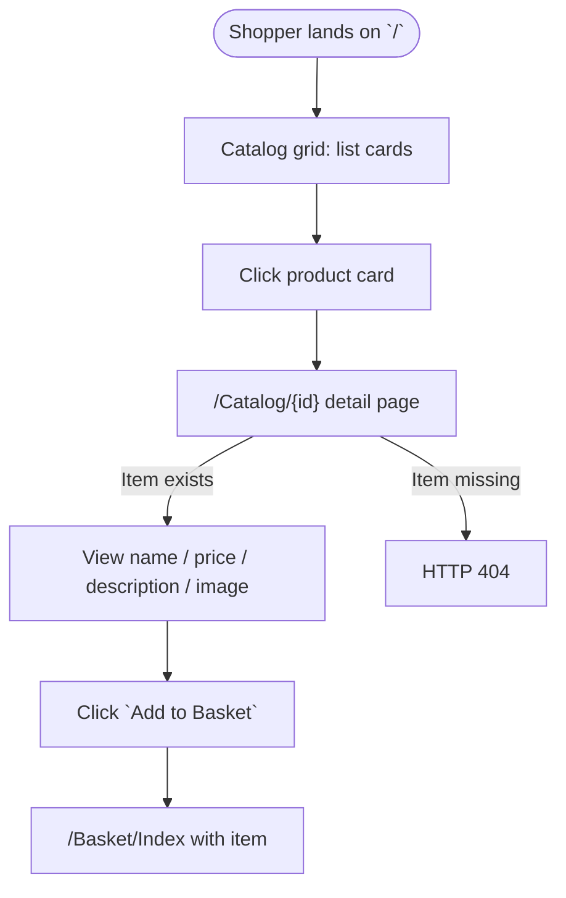

# Product Detail Page

## Business Context

Today the storefront grid (`src/Web/Pages/Index.cshtml` + `Pages/Shared/_product.cshtml`)
posts `Add to Basket` directly from the catalog card. Shoppers never see a
dedicated page that shows the full product description or larger image. This
change introduces a product detail page at `/Catalog/{id}` that shows name,
price, image and description, and re-hosts the `Add to Basket` action there.
The home grid card becomes a link into the detail page instead of an inline
Add form.

## User Story

> As a shopper, I want to click on a product in the catalog to see its full
> details (name, price, image, description) before deciding to buy, so that I
> can make an informed purchase decision.

## Acceptance Criteria

**AC1 – Grid links to detail page**

> Given the shopper is on the home page
> When they view a catalog card
> Then the card links to `/Catalog/{id}` for that item
> And the card does not post an `Add to Basket` form inline

**AC2 – Detail page shows product information**

> Given an item with id `2` exists
> When the shopper visits `/Catalog/2`
> Then the page shows the item's name, price, description, and image

**AC3 – Add to Basket from the detail page**

> Given the shopper is on `/Catalog/2`
> When they click `Add to Basket`
> Then the item is added to the basket
> And the shopper is redirected to `/Basket/Index` showing the item name

**AC4 – Unknown id returns 404**

> Given no catalog item with id `999999` exists
> When the shopper visits `/Catalog/999999`
> Then the server returns `404 Not Found`

**AC5 – Home card links with item id**

> Given the shopper is on the home page
> When they inspect a catalog card
> Then there is an anchor with `href` containing `/Catalog/{id}`

## User Journey

## Dependencies

- `IRepository<CatalogItem>` (`Ardalis.Specification`) — single-item lookup via `GetByIdAsync`.
- `IUriComposer.ComposePicUri(string)` — composes picture URI.
- `IBasketService.AddItemToBasket` — existing basket add flow (re-used on POST).
- `Basket/Index.cshtml.cs`'s `OnPost` — existing endpoint; detail page will POST to `/Basket/Index` with the same `CatalogItemViewModel` shape (`id`, `name`, `pictureUri`, `price`). No new basket endpoint required.

## Scope

**In scope**

- New Razor Page `src/Web/Pages/Catalog/Detail.cshtml` (+ `.cs`) with route `@page "{id:int}"`.
- New `CatalogItemDetailViewModel` (includes `Description`).
- Update `src/Web/Pages/Shared/_product.cshtml` to link to the detail page instead of inline add-to-basket.
- `tests/WebTests/Features/Catalog.feature` with Reqnroll scenarios covering AC1–AC5.
- `tests/WebTests/StepDefinitions/CatalogSteps.cs` step definitions.
- Adjust existing `BasketSteps` helper if necessary so existing `Basket.feature` scenarios still pass after the home card no longer hosts the add form. (Plan: add-to-basket in Basket.feature will navigate to the detail page first, then post the add — this keeps the existing step contract `the shopper adds catalog item "{id}" named "{name}" to the basket`.)

**Out of scope**

- Admin edit UX changes.
- PublicApi / Blazor admin changes.
- DB migrations — `Description` already exists on `CatalogItem`.
- Styling polish beyond minimal `_Layout`-compatible markup.
- Reviews, related items, add-to-wishlist.

## Implementation Order (TDD, bottom-up)

1. **Gherkin feature file + confirm** — `tests/WebTests/Features/Catalog.feature` (AC1–AC5).
2. **Step definitions (RED)** — `tests/WebTests/StepDefinitions/CatalogSteps.cs`.
3. **View model (GREEN shell)** — `src/Web/ViewModels/CatalogItemDetailViewModel.cs`.
4. **Razor Page** — `src/Web/Pages/Catalog/Detail.cshtml.cs` + `Detail.cshtml`.
5. **Update home card** — `src/Web/Pages/Shared/_product.cshtml` linkifies to the detail page.
6. **Update BasketSteps** — `AddItemToBasket` step now GETs `/Catalog/{id}` first (to obtain an anti-forgery token for the add form), then POSTs to `/basket/index`. This keeps existing Basket.feature scenarios green.
7. **Run full suite** — `dotnet test`; iterate.
8. **Code review** — invoke code-reviewer agent.

## Critical Files

| File | Change |
|---|---|
| `src/Web/Pages/Catalog/Detail.cshtml` | **new** — detail view |
| `src/Web/Pages/Catalog/Detail.cshtml.cs` | **new** — PageModel: GET loads item; 404 if missing |
| `src/Web/ViewModels/CatalogItemDetailViewModel.cs` | **new** — detail view model (includes `Description`) |
| `src/Web/Pages/Shared/_product.cshtml` | **modify** — card becomes a link to `/Catalog/{id}` |
| `tests/WebTests/Features/Catalog.feature` | **new** — Gherkin scenarios |
| `tests/WebTests/StepDefinitions/CatalogSteps.cs` | **new** — step definitions |
| `tests/WebTests/StepDefinitions/BasketSteps.cs` | **modify** — `AddItemToBasket` now goes via detail page |

## Verification

- `dotnet build` succeeds.
- `dotnet test tests/WebTests/WebTests.csproj` green (new Catalog scenarios + existing Basket scenarios).
- `dotnet test` at solution root green (no regressions elsewhere).
- Manual: start the app, visit `/`, click a product, verify description + image, add to basket, confirm redirect to `/Basket/Index`.

## Progress Log

- 2026-04-19 — Plan drafted; starting Phase 3 (Gherkin).
- 2026-04-19 — `Catalog.feature` + `CatalogSteps` added (7 scenarios).
- 2026-04-19 — `CatalogItemDetailViewModel`, `Detail.cshtml(.cs)`, `_product.cshtml` linkify, `BasketSteps.AddItemToBasket` + 3 integration tests updated to fetch the antiforgery token from the detail page.
- 2026-04-19 — Full solution green: UnitTests 49/49, IntegrationTests 3/3, WebTests 35/35, PublicApiTests 95/95. Status: **Complete**.
