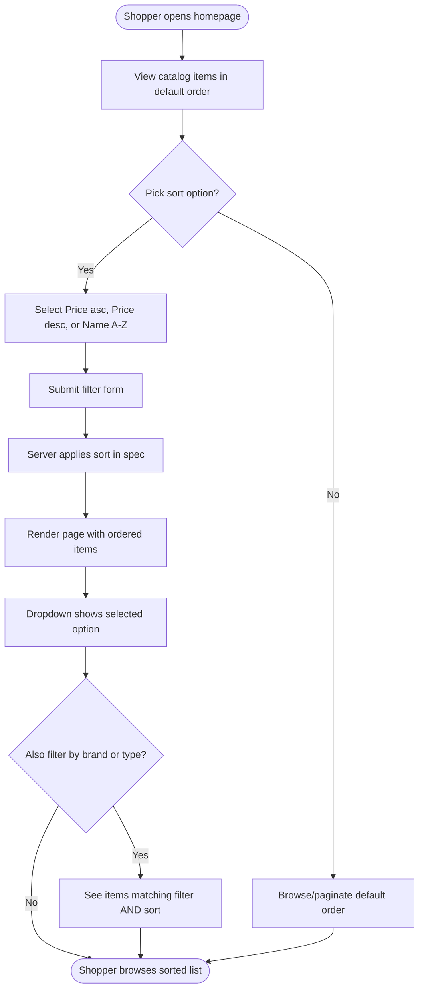

# Catalog Sort Dropdown

## Business Context

The storefront homepage (`/`) currently lets shoppers filter the catalog by
**Brand** and **Type**, but every result set is returned in database insertion
order. Shoppers scanning for a bargain or trying to locate a specific product
have no way to reorder the list, which forces them to eyeball each page. This
feature adds a **Sort** dropdown beside the existing filters with three options
— *Price: Low to High*, *Price: High to Low*, *Name: A–Z* — so shoppers can
browse the catalog the way they prefer without losing the Brand/Type filters
they've already applied.

## User Stories

**As a** shopper
**I want** to sort the catalog by price (low-to-high, high-to-low) or by name (A–Z)
**So that** I can browse products in the order that matches how I'm shopping

**As a** shopper using the Brand or Type filters
**I want** my sort choice preserved across pagination and alongside my active filters
**So that** I don't have to re-apply my preferences on every page

## Acceptance Criteria

### AC1 — Sort by Price: Low to High
**Given** the shopper is on the catalog homepage
**When** the shopper selects "Price: Low to High" and submits
**Then** the visible catalog items on the current page are ordered by `Price` ascending

### AC2 — Sort by Price: High to Low
**Given** the shopper is on the catalog homepage
**When** the shopper selects "Price: High to Low" and submits
**Then** the visible catalog items on the current page are ordered by `Price` descending

### AC3 — Sort by Name: A–Z
**Given** the shopper is on the catalog homepage
**When** the shopper selects "Name: A–Z" and submits
**Then** the visible catalog items on the current page are ordered by `Name` ascending (case-insensitive lexical)

### AC4 — Default ordering unchanged
**Given** the shopper loads the homepage with no sort selected
**When** the page renders
**Then** items appear in the default (insertion / primary-key) order — no behavioural change from today

### AC5 — Sort composes with Brand / Type filters
**Given** the shopper has applied a Brand or Type filter
**When** the shopper also selects a sort option and submits
**Then** the results match **both** the filter and the sort

### AC6 — Selected sort is preserved in the dropdown
**Given** the shopper has just submitted a sort
**When** the page re-renders
**Then** the sort dropdown displays the currently applied option as selected

## User Journey

## Dependencies

- `Ardalis.Specification` (`Query.OrderBy` / `Query.OrderByDescending`) — already referenced in `ApplicationCore`
- ASP.NET Core Razor Pages tag helpers (`asp-for`, `asp-items`)
- `IMemoryCache` — must include sort in cache key

## Scope

### In Scope
- New `CatalogSortOption` enum in `ApplicationCore`
- `CatalogFilterPaginatedSpecification` accepts optional `CatalogSortOption`
- `ICatalogViewModelService.GetCatalogItems` signature extended with sort parameter
- `CachedCatalogViewModelService` cache key includes sort
- `CatalogIndexViewModel` exposes `Sorts` (`List<SelectListItem>`) and `SortApplied`
- `Index.cshtml` adds a sort dropdown next to Brand/Type
- Unit tests for the spec ordering
- Reqnroll scenarios for sort UI behaviour

### Out of Scope
- Sorting in admin PublicApi / BlazorAdmin (separate project)
- Sort on Catalog Detail page
- Multi-column composite sort
- User preference persistence across sessions
- Sort direction on `Name` (only A–Z is requested)

## TDD Task Breakdown

Outside-in, bottom-up implementation order:

| # | Step | File(s) | Test First |
|---|------|---------|------------|
| 1 | Add `CatalogSortOption` enum | `src/ApplicationCore/Specifications/CatalogSortOption.cs` | no (trivial enum) |
| 2 | Extend `CatalogFilterPaginatedSpecification` ctor to accept sort | `src/ApplicationCore/Specifications/CatalogFilterPaginatedSpecification.cs` | **yes — unit test** |
| 3 | Extend `ICatalogViewModelService` + `CatalogViewModelService` | `src/Web/Interfaces/ICatalogViewModelService.cs`, `src/Web/Services/CatalogViewModelService.cs` | covered by BDD + existing types |
| 4 | Extend `CachedCatalogViewModelService` + `CacheHelpers` | `src/Web/Services/CachedCatalogViewModelService.cs`, `src/Web/Extensions/CacheHelpers.cs` | covered by BDD |
| 5 | Extend `CatalogIndexViewModel` with `Sorts` + `SortApplied` | `src/Web/ViewModels/CatalogIndexViewModel.cs` | — |
| 6 | Populate `GetSorts()` (static SelectList) | `src/Web/Services/CatalogViewModelService.cs` | — |
| 7 | Add sort select to `Index.cshtml` | `src/Web/Pages/Index.cshtml` | — |
| 8 | Pass `sortApplied` through `OnGet` | `src/Web/Pages/Index.cshtml.cs` | — |
| 9 | Reqnroll scenarios + step defs | `tests/WebTests/Features/Catalog.feature`, `tests/WebTests/StepDefinitions/CatalogSteps.cs` | **yes — BDD** |

## Complexity Assessment

**E2E Path criteria**:
- [x] User-facing UI component (homepage dropdown)
- [x] Crosses multiple layers (UI → Service → Spec → DB query)
- [ ] Business-critical workflow (browse-only, not checkout)
- [ ] Complex state / multi-step process
- [ ] Multiple user roles

**Simplified TDD criteria**:
- [ ] Internal / backend only (it's UI)
- [ ] Single layer change (crosses 4 layers)
- [x] Utility-like (mostly add-a-parameter)

**Decision**: **E2E Path** — two E2E criteria apply, and there is an existing
`Catalog.feature` + `CatalogSteps.cs` harness we can extend cheaply. Running
Reqnroll scenarios end-to-end catches regressions in query-string binding, the
tag-helper selection state, and pagination preservation.

## Progress Log

- 2026-04-20 — Plan drafted, Phase 2 complete.
- 2026-04-20 — Phase 3 complete: `CatalogSortOption` enum + spec ordering (6/6 unit tests), service + cache key plumbing, Razor Page dropdown, Reqnroll scenarios + step definitions (all 16 Catalog BDD scenarios pass).
- 2026-04-20 — Phase 4: Full test suite green (UnitTests 54, IntegrationTests 3, WebTests 43, PublicApiTests 95 = 195 tests). Code review flagged two issues:
  1. Out-of-range enum value via URL (`?SortApplied=99`) bound successfully and polluted the cache key. Fixed in `Index.cshtml.cs` by validating with `Enum.IsDefined` at the page boundary, added scenario "Out-of-range sort value is ignored".
  2. Specification builder chain was broken; refactored to a `switch` expression returning `ISpecificationBuilder<CatalogItem>` so `Skip/Take` chain stays intact and future `Include/ThenBy` additions don't silently fail.
- 2026-04-20 — Feature complete.
