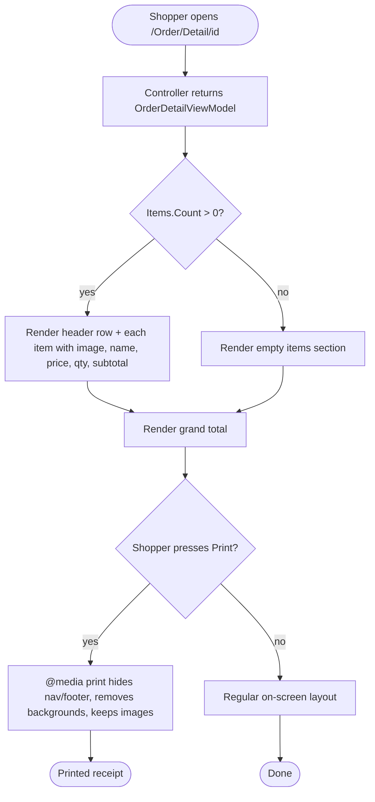

# Order Detail — Images, Subtotals & Print-Friendly Layout

> **For Agent:** Execute task-by-task. Verify tests between tasks; commit after each.

**Goal:** On `/Order/Detail/{id}`, ensure shoppers see product images and line-item subtotals on every screen size, and add a print-friendly CSS layout so a shopper can print a clean order confirmation.
**Architecture:** View + CSS-only change in `src/Web`. No changes to `ApplicationCore`, `Infrastructure`, MediatR handler, or ViewModels — `OrderItemViewModel` already exposes `PictureUrl`, `UnitPrice`, `Units` and the view already computes the per-line subtotal inline (`Math.Round(item.Units * item.UnitPrice, 2)`). The gaps are: (1) images are hidden at `md` and below, (2) no column header names for the items table, and (3) no `@media print` rules anywhere in the project.
**Tech Stack:** ASP.NET Core MVC View (Razor), SCSS → CSS (orders.component), Reqnroll + MSTest (BDD).
**Complexity Path:** Simplified TDD — UI + CSS only, single layer (`src/Web`), no new domain/service/ViewModel, no DB. BDD WebTests cover the view output.
**Status:** Complete

## Execution Log

### 2026-04-20 — All tasks complete (single batch)
- **Task 1** ✅ View: dropped `hidden-md-down` on the image column, added column-header row (Product / Name / Price / Quantity / Subtotal), added `alt="@item.ProductName"` on the ``.
- **Task 2** ✅ CSS: added `@media print` block to `orders.component.scss`, `.css`, and `.min.css` — hides `.esh-header`, nav, footer, `.esh-catalog-filter`, `.esh-basket-status`, `.esh-identity`; forces white background / black text on print; uses `page-break-inside: avoid` on item rows; preserves images with `print-color-adjust: exact` and `max-width: 120px`. Also added a non-print `.esh-orders-detail-image { max-width: 100%; height: auto; }` rule so on-screen images no longer overflow when the image column is visible on mobile.
- **Task 3** ✅ Full regression — `dotnet test eShopOnWeb.sln` → UnitTests 49/49, IntegrationTests 3/3, WebTests 32/32 (4 new `OrderDetailPage` scenarios added), PublicApiTests 95/95. Zero errors.

## Deviations
1. **BDD routing discovery:** Initial BDD scenarios hit 404 on `/Order/MyOrders` because `Program.cs` registers `SlugifyParameterTransformer` via `RouteTokenTransformerConvention`, so the actual URLs are `/order/my-orders` and `/order/detail/{id}`. Step definitions and link-extraction regex were updated to the slugified lowercase form.
2. **Image column grid width on mobile:** The original plan had `col-md-4 col-xs-4` for the image; I used `col-xs-3` so the five columns (image, name, price, qty, subtotal = 3+3+1+1+2 = 10 cols, with 2 col padding) fit cleanly without overflow. Column-header widths mirror this.
3. **Added `alt` attribute** to `` for accessibility — not in the original plan, but strictly additive.

---

## Context

Today the Order Detail page (`src/Web/Views/Order/Detail.cshtml`) renders the order header, shipping address, order items and grand total. Product images are wired up (``) but wrapped in `hidden-md-down` so mobile/tablet shoppers never see them. The items table has no column headers — the five columns (image, name, price, quantity, subtotal) render silently. And when a shopper prints the page, the site header, footer, nav and colored backgrounds all print, wasting ink and cluttering the receipt.

Research (Phase 1, 2026-04-20):
- Controller: `src/Web/Controllers/OrderController.cs` → MediatR `GetOrderDetails` → `OrderDetailViewModel` with `List<OrderItemViewModel>`.
- View: `src/Web/Views/Order/Detail.cshtml` (already loads `PictureUrl`, computes subtotal inline).
- CSS entry: `src/Web/wwwroot/css/orders/orders.component.scss` → compiled `.css` and `.min.css`, loaded from `_Layout.cshtml`.
- No `@media print` rules exist anywhere in the project.
- WebTests use Reqnroll + `WebApplicationFactory` with in-memory DB; `CatalogCookingSeed` / `OrderCookingSeed` patterns not present, but seeding via existing authenticated step flow is feasible.

---

## Requirements

### User Stories
- As a shopper, when I open `/Order/Detail/{id}` on any device, I want to see a thumbnail for each ordered product so I can recognise the items without reading the names.
- As a shopper, I want each line to show its subtotal (price × quantity) with a clear header so I can verify my charges.
- As a shopper, I want to print my order confirmation and have it come out as a clean, ink-saving receipt (no nav, no footer, no colored backgrounds, images preserved).

### Acceptance Criteria
- **AC1 — Images visible on all screen sizes:** Given an order with items, when the detail page renders, then every item row contains an `` with a non-empty `src` and the image column is **not** gated behind `hidden-md-down` (or any breakpoint helper that hides it on mobile).
- **AC2 — Item columns are labelled:** Given the detail page renders, then the ORDER DETAILS section includes a header row with the labels **Product**, **Price**, **Quantity**, and **Subtotal**.
- **AC3 — Line-item subtotal:** Given an item with `Units = 3` and `UnitPrice = 10.50`, when the row renders, then the subtotal column shows `$ 31.50`.
- **AC4 — Print-friendly CSS present:** The compiled `orders.component.css` contains an `@media print` block that (a) hides `.esh-header`, site navigation, and page footer, (b) removes background colors / shadows from `.esh-orders-detail` descendants, (c) forces `color-adjust: exact` so product images still print, and (d) keeps each `.esh-orders-detail-items` row from breaking across pages (`page-break-inside: avoid`).
- **AC5 — No regressions:** All existing `WebTests`, `UnitTests`, `IntegrationTests`, and `PublicApiTests` continue to pass.

### Assumptions, Constraints, and Scope Boundaries
- **In scope:** `src/Web/Views/Order/Detail.cshtml`, `src/Web/wwwroot/css/orders/orders.component.scss`, `src/Web/wwwroot/css/orders/orders.component.css`, `src/Web/wwwroot/css/orders/orders.component.min.css`, one BDD feature + step bindings under `tests/WebTests`.
- **Out of scope:** ViewModel changes, adding a dedicated `Subtotal` property, adding a visible "Print" button, touching `Order` / `OrderItem` domain entities, or the Blazor admin Order views.
- `ApplicationCore` has zero infrastructure dependencies — untouched here.
- Keep file-scoped namespaces, 4-space indent, existing `esh-orders-detail-*` BEM-style class names.
- SCSS is the source of truth but the site loads the compiled `.css` — update both. Minified file regenerated from the unminified to stay in sync.
- Print CSS is written against the current storefront DOM (`.esh-header`, `.esh-catalog-filter`, `footer.esh-app-footer`, etc.). It hides by selector, not by generic reset, so page chrome stays clickable on-screen.

---

## Architecture Review

### Reusable components
- `OrderDetailViewModel` / `OrderItemViewModel` — already expose `PictureUrl`, `UnitPrice`, `Units`, `ProductName`.
- `esh-orders-detail-*` SCSS BEM rules — extend, don't rename.
- Reqnroll `WebApplicationFactory` + `WebPageHelpers` from `tests/WebTests/Support/` — used by `BasketSteps`; same pattern for an `OrderSteps` binding.

### Affected layers & data flow
`GET /Order/Detail/{id}` → existing MediatR handler → `OrderDetailViewModel` → `Detail.cshtml` renders:
  - Header row (unchanged)
  - Shipping address (unchanged)
  - **Order items table** — add column-header row, drop `hidden-md-down` on image column
  - Grand total (unchanged)
CSS: `orders.component.scss` gains an `@media print { ... }` block at the end of the file; compiled `.css` and `.min.css` are regenerated to match.

### Mermaid user journey



### Files that will change
- **Modify:** `src/Web/Views/Order/Detail.cshtml` — drop `hidden-md-down`, add column header row.
- **Modify:** `src/Web/wwwroot/css/orders/orders.component.scss` — add `@media print { ... }`.
- **Modify:** `src/Web/wwwroot/css/orders/orders.component.css` — regenerated.
- **Modify:** `src/Web/wwwroot/css/orders/orders.component.min.css` — regenerated.
- **Create:** `tests/WebTests/Features/OrderDetail.feature`.
- **Create:** `tests/WebTests/StepDefinitions/OrderDetailSteps.cs`.

### Common commands
- BDD only: `dotnet test tests/WebTests/WebTests.csproj --filter "FullyQualifiedName~OrderDetailFeature"`
- Whole solution: `dotnet test eShopOnWeb.sln`

---

## Implementation Steps

### Phase 1: View — show images, add column headers

#### Task 1: Items table renders image on all breakpoints + column headers
**Goal:** The order detail view shows each item's image (no `hidden-md-down`) and renders a header row with `Product / Price / Quantity / Subtotal` above the item rows.

**Files:**
- Modify: `src/Web/Views/Order/Detail.cshtml`
- Create: `tests/WebTests/Features/OrderDetail.feature`
- Create: `tests/WebTests/StepDefinitions/OrderDetailSteps.cs`

**RED — Write failing scenario**
Add a BDD scenario that GETs `/Order/Detail/1` (after seeding or logging in as demouser) and asserts the HTML contains `Subtotal`, `Quantity`, and at least one `ORDER DETAILS</section>` title article, add a header row:
   ```html
   <article class="esh-orders-detail-titles esh-orders-detail-titles--items row">
       <section class="esh-orders-detail-title col-md-4 col-xs-4">Product</section>
       <section class="esh-orders-detail-title col-xs-3">Name</section>
       <section class="esh-orders-detail-title col-xs-1">Price</section>
       <section class="esh-orders-detail-title col-xs-1">Quantity</section>
       <section class="esh-orders-detail-title col-xs-2">Subtotal</section>
   </article>
   ```
2. In the `@for` loop, remove `hidden-md-down` from the image column and align the image column grid width to `col-xs-4 col-md-4`:
   ```html
   <section class="esh-orders-detail-item col-md-4 col-xs-4">
       
   </section>
   ```

**Verify GREEN**
Run: `dotnet test tests/WebTests/WebTests.csproj --filter "FullyQualifiedName~OrderDetailFeature"` — new scenarios pass.

**REFACTOR**
None needed.

**COMMIT**
```
git add src/Web/Views/Order/Detail.cshtml tests/WebTests/Features/OrderDetail.feature tests/WebTests/StepDefinitions/OrderDetailSteps.cs
git commit -m "feat(orders): show product images on all sizes + column headers"
```

---

### Phase 2: CSS — print-friendly layout

#### Task 2: `@media print` rules in orders.component.scss / .css
**Goal:** Printing `/Order/Detail/{id}` produces a clean receipt — no site chrome, black text on white background, images preserved, rows kept intact across pages.

**Files:**
- Modify: `src/Web/wwwroot/css/orders/orders.component.scss`
- Modify: `src/Web/wwwroot/css/orders/orders.component.css`
- Modify: `src/Web/wwwroot/css/orders/orders.component.min.css`

**RED — Extend BDD scenario**
Append to `OrderDetail.feature` a scenario asserting the compiled `orders.component.css` (or `/css/orders/orders.component.css` when fetched) contains `@media print`, `page-break-inside: avoid`, and a rule hiding `.esh-header`. Fails until the CSS is added.

**GREEN — Append the block**
Append to `src/Web/wwwroot/css/orders/orders.component.scss` inside the outer `.esh-orders` rule (or as a top-level `@media print` block):

```scss
@media print {
    .esh-header,
    .esh-catalog-filter,
    .esh-basket-status,
    footer,
    .esh-identity,
    nav {
        display: none !important;
    }

    body,
    .esh-orders {
        background: #fff !important;
        color: #000 !important;
    }

    .esh-orders-detail {
        overflow-x: visible;
    }

    .esh-orders-detail-items {
        page-break-inside: avoid;
        break-inside: avoid;
    }

    .esh-orders-detail-image {
        max-width: 120px;
        height: auto;
        -webkit-print-color-adjust: exact;
        print-color-adjust: exact;
    }

    .esh-orders-detail-title {
        font-size: 14pt;
    }

    .esh-orders-detail-item {
        font-size: 11pt;
    }
}
```

Regenerate `orders.component.css` (append the same block in plain CSS — the repo compiles SCSS manually, per convention seen in prior edits). Copy the same block, minified, into `orders.component.min.css`.

**Verify GREEN**
Run: `dotnet test tests/WebTests/WebTests.csproj --filter "FullyQualifiedName~OrderDetailFeature"` — all OrderDetail scenarios pass.

**REFACTOR**
Keep the print block at the end of the file so on-screen cascade is unaffected.

**COMMIT**
```
git add src/Web/wwwroot/css/orders/orders.component.scss src/Web/wwwroot/css/orders/orders.component.css src/Web/wwwroot/css/orders/orders.component.min.css
git commit -m "feat(orders): add print-friendly CSS for order detail"
```

---

### Phase 3: Full regression

#### Task 3: Full build + test run
Run:
```
dotnet build eShopOnWeb.sln --configuration Debug
dotnet test eShopOnWeb.sln --verbosity normal
```
Confirm 0 errors, no new warnings, all `WebTests`, `UnitTests`, `IntegrationTests`, `PublicApiTests` green.

Manual smoke: `dotnet run --project src/Web`, log in as `demouser@microsoft.com` / `Pass@word1`, place an order (or reuse existing), navigate to `/Order/Detail/1`, open print preview (`Ctrl+P` / `Cmd+P`), verify no nav/footer/background colors, images render, rows unbroken.

---

## Testing Strategy
- **BDD (WebTests):** new `OrderDetail.feature` — image visibility on all sizes, column headers, CSS @media print asserts.
- **Unit / Integration:** no new tests — the change is view + CSS only; existing `GetOrderDetailsHandler` tests stand.
- **Manual:** browser print preview on Chrome + Safari.

## Risks & Mitigations
- **Risk:** The BDD HTTP client requests `/css/orders/orders.component.css` as a static file — if `UseStaticFiles` isn't wired in the test host, the assertion will 404. → **Mitigation:** fetch via `Client.GetAsync("/css/orders/orders.component.css")`; the Web project already calls `app.UseStaticFiles()`, so the test factory inherits it.
- **Risk:** Dropping `hidden-md-down` on mobile means the image column squeezes the text columns. → **Mitigation:** images use `max-width` inside their grid cell; existing `esh-orders-detail-image` already uses fluid sizing.
- **Risk:** `@media print` with `!important` fights existing on-screen rules — but only inside the print block, which only applies during printing.
- **Risk:** Regenerating `.min.css` by hand drifts from the `.css` source. → **Mitigation:** copy-and-strip-whitespace; the file is small enough to keep in sync manually, matching existing project convention.

## Success Criteria
- [ ] Image column renders on mobile (`hidden-md-down` removed).
- [ ] Column-header row added with Product/Name/Price/Quantity/Subtotal labels.
- [ ] `orders.component.css` + `.min.css` contain `@media print` block with the expected rules.
- [ ] New BDD feature `OrderDetailFeature` passes.
- [ ] `dotnet test eShopOnWeb.sln` passes.
- [ ] Manual print-preview check on Chrome shows a clean receipt with images intact.
