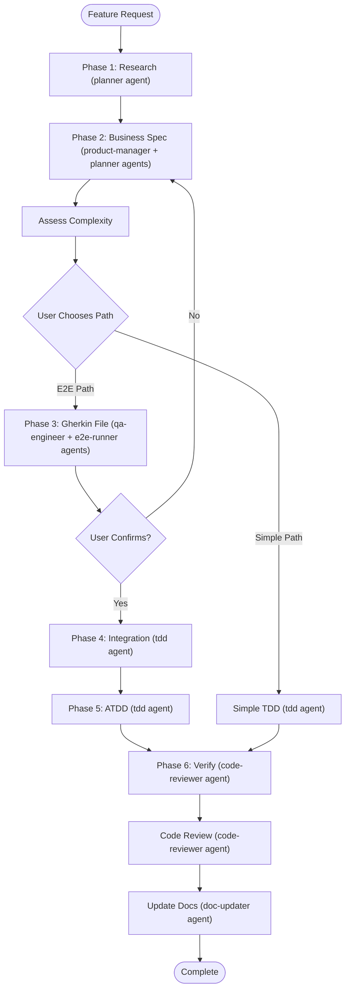

# Spec-Driven Development

Orchestrate complete outside-in development workflow from business requirements to implementation, with dual-path approach based on feature complexity.

## Environment Detection

This skill works in both **Cursor** and **Claude Code**. The agent should detect the environment and adapt behavior accordingly:

**Cursor indicators**:
- `CreatePlan` tool available in system
- `.cursor/` directory exists in workspace

**Claude Code indicators**:
- Running as Claude CLI
- `CLAUDE.md` file present in workspace
- `.claude/` directory exists in workspace

**Behavior differences**:
- **Interaction mode**: This workflow may run in any mode. Do not block on plan mode.
- **Plan file creation**: In Cursor, can use `CreatePlan` tool. In Claude Code, create file directly at `docs/plans/`.
- **Skill file reading**: Use relative paths from this skill's location (`../sibling-skill/SKILL.md`) - works in both environments.

## Prerequisites Check

**CRITICAL: This workflow may run in any mode, but it must create and save the Phase 2 plan file before implementation continues.**

1. Detect the current environment (Cursor or Claude Code)
2. Confirm Phase 2 will create `docs/plans/YYYY-MM-DD-{summary}.md`
3. Proceed with the workflow

## Workflow Overview



## Agent Integration

This skill orchestrates agents defined in `agents/` (see `AGENTS.md` for full orchestration guide):

| Phase | Agent(s) | Role |
|-------|----------|------|
| Phase 1: Research | **planner** | Codebase exploration, requirement analysis |
| Phase 2: Business Spec | **product-manager**, **planner** | User stories, acceptance criteria, plan file |
| Phase 3: Gherkin File | **qa-engineer**, **e2e-runner** | Feature file creation, step definitions |
| Phase 4: Integration | **tdd** | Integration skeleton implementation, layered hardcoded build |
| Phase 5: ATDD | **tdd** | Red-Green-Refactor, test-first implementation |
| Phase 6: Verify | **code-reviewer** | Quality, security, performance review |
| Post-completion | **doc-updater** | Update codemaps and documentation |

**Parallel agent execution** (when applicable):
- Phase 3: **qa-engineer** (feature file) + **e2e-runner** (step definition patterns) in parallel
- Phase 6: **code-reviewer** + **doc-updater** in parallel

## Phase 1: Thorough Research and Discovery

**Purpose**: Conduct comprehensive research before suggesting any solutions

**Research Activities**:

1. **Codebase exploration** (explore the codebase in parallel; in Cursor: use Task tool with explore subagent):
   - Parallel exploration of different areas
   - Search for existing patterns
   - Identify relevant files and structures
   - Document existing conventions
   - Note file paths and module organization

2. **Requirement analysis**:
   - Extract user intent from request
   - Identify ambiguities
   - List missing information
   - Review recent changes (git diff, git log)

3. **Questioning phase** (ask the user clarifying questions; in Cursor: use AskQuestion tool):
   - Ask ONLY critical clarifying questions (1-2 max)
   - Never proceed with ambiguous requirements
   - Confirm scope boundaries

**Research checklist**:
- [ ] Existing feature patterns identified
- [ ] Project structure understood
- [ ] Test framework configuration verified
- [ ] E2E test project location confirmed
- [ ] Database schema access confirmed
- [ ] All ambiguities resolved
- [ ] Scope clearly defined

**Research output format**:

## Phase 1: Research Findings

### Project Structure
- E2E Tests: `[path]`
- Unit Tests: `[path]`
- Integration Tests: `[path]`

### Existing Patterns
**Authentication Pattern** (`path/to/auth/service.cs`):

```csharp
[relevant code snippet with context]
```

### Dependencies Identified
- Dependency 1: [Description]
- Dependency 2: [Description]

### Clarifications Needed
- Question 1: [What needs clarification]

## Phase 2: Business Specification

**Purpose**: Create business-level specifications from user perspective

**Output**: Plan file at `docs/plans/YYYY-MM-DD-{summary}.md`

**Plan File Creation Timing**: Create the plan file after drafting the business spec content below, before presenting the complexity assessment to the user. The plan file is the deliverable of Phase 2.

**Contents**:
- Business context (1-2 paragraphs)
- User stories (As a/I want/So that)
- Acceptance criteria (Given/When/Then)
- User journey Mermaid flowchart (required)
- Dependencies list
- Scope definition (in/out)

**Key principles**:
- Business perspective only
- No implementation details
- Focus on WHAT, not HOW

**Example inline** (Senku domain):

**User Story**: As a VIP manager, I want to view a breakdown of VIP tier performance by product, so that I can identify which products are driving VIP engagement.

**Acceptance Criteria**:
- **AC1**: Given I am on the VIP Management page, When I select a date range and product filter, Then I should see a table showing each VIP tier's player count, turnover, and winning for the selected products.
- **AC2**: Given the VIP breakdown table is displayed, When I click on a tier row, Then I should navigate to the detailed tier breakdown page for that specific tier.

### Complexity Assessment Decision Point

**After spec complete, assess feature complexity:**

**E2E Path criteria** (if ANY apply):
- [ ] User-facing UI component
- [ ] Crosses multiple layers (UI → API → DB)
- [ ] Business-critical workflow
- [ ] Complex state/multi-step process
- [ ] External system integration
- [ ] Multiple user roles
- [ ] Complex data transformation

**Simple TDD criteria** (if feature matches ANY of the following AND none of the E2E criteria apply):
- Internal/backend only
- Single layer change
- Utility function
- Bug fix
- Configuration change
- Simple CRUD

**Present to user:**

```
## Phase 2 Complete ✅

**Complexity Assessment**:
✅ Criteria met: [List]
❌ Not applicable: [List]

**My Recommendation**: [E2E Path | Simplified TDD Path]
**Rationale**: [Explanation]

**Options**:
1. E2E Path - Gherkin + integration-first + ATDD (Phases 3-6)
2. Simplified TDD - Unit + integration tests only
3. Your recommendation

Which path? (Required before proceeding)
```

**STOP and wait for user confirmation**

## Path A: E2E Path (Complex Features)

### Phase 3: Create Gherkin Feature File

**Purpose**: Translate specs into executable acceptance tests

**Workflow**: Generate → Present → Confirm → Create

**Presentation**: Present the complete Gherkin feature file as a code block in your response. After user confirms it accurately captures requirements, create the file at the specified location.

**If user rejects the Gherkin file**:
- If the scenarios are wrong or incomplete → revise and re-present the Gherkin file
- If the underlying requirements are wrong → return to Phase 2, update the business spec and acceptance criteria, then regenerate the Gherkin file
- Do not proceed to Phase 4 until the user explicitly confirms the Gherkin file

**Feature file structure**:
```gherkin
@FeatureName @RequiresTestData
Feature: Feature Name
    As a [role]
    I want [goal]
    So that [benefit]

Background:
    Given [common precondition]

@AC1
Scenario: Primary scenario
    Given [context]
    When [action]
    Then [expected outcome]

@AC2
Scenario Outline: Data-driven test
    When [action with "<param>"]
    Then [expected outcome]
    
    Examples:
      | param | expected |
      | val1  | result1  |
```

**File location**: `{ProjectName}.E2ETests/Features/{FeatureName}.feature`

### Transition to Implementation

**Phase scope**: Phases 1-3 focus on research and specification. Phases 4-6 perform implementation and verification.

**After user confirms the Gherkin file (or after choosing Simplified TDD path):**

Tell user: "Specification phases complete (Phases 1-3 done). The plan file is saved. The repo plan file, not the in-memory todo list, is the execution record. Ready to begin implementation (Phases 4-6)."

Wait for user confirmation before proceeding to Phase 4 / Path B.

### Phase 4: Integration-First

**Purpose**: Build end-to-end flow with hardcoded data to prove the integration works before adding real logic

**Agent**: Use **tdd** agent for skeleton implementation, building the layered architecture (Repository → Service → Controller → UI) with hardcoded data

**IMPORTANT**: Follow coding standards
- Read `../dotnet-coding-standards/SKILL.md` for .NET best practices
- Read `../tdd-workflow/SKILL.md` for TDD methodology

**Layer-by-layer Build Order**:

1. **Repository Layer** (in-memory storage):
   ```csharp
   private static readonly Dictionary<int, VipTier> _vipTiers = new()
   {
       { 1, new VipTier { Id = 1, Name = "Bronze", MinDeposit = 100 } },
       { 2, new VipTier { Id = 2, Name = "Silver", MinDeposit = 500 } }
   };
   
   public async Task<List<VipTier>> GetVipTiers()
   {
       return await Task.FromResult(_vipTiers.Values.ToList());
   }
   ```

2. **Service Layer** (fake business logic):
   ```csharp
   public async Task<VipBreakdownResult> GetVipBreakdown(VipBreakdownRequest request)
   {
       // Hardcoded response
       return new VipBreakdownResult
       {
           Tiers = new List<VipTierSummary>
           {
               new() { TierName = "Bronze", PlayerCount = 150, Turnover = 50000 },
               new() { TierName = "Silver", PlayerCount = 80, Turnover = 200000 }
           }
       };
   }
   ```

3. **API Controller** (mock responses):
   ```csharp
   [HttpPost("api/vip/breakdown")]
   public IActionResult GetVipBreakdown([FromBody] VipBreakdownRequest request)
   {
       // Return hardcoded success response
       return Ok(new 
       { 
           tiers = new[] 
           {
               new { tierName = "Bronze", playerCount = 150, turnover = 50000 },
               new { tierName = "Silver", playerCount = 80, turnover = 200000 }
           }
       });
   }
   ```

4. **Frontend (Vue 3 + Tailwind CSS)**:
   ```vue
   <script setup>
   // Hardcoded static data
   const vipBreakdown = ref([
     { tierName: 'Bronze', playerCount: 150, turnover: 50000 },
     { tierName: 'Silver', playerCount: 80, turnover: 200000 }
   ]);
   </script>

   <template>
     <div class="p-6">
       <h1 class="text-2xl font-bold mb-4">VIP Breakdown</h1>
       <table class="w-full border-collapse">
         <thead>
           <tr class="bg-gray-100">
             <th class="p-2 text-left">Tier</th>
             <th class="p-2 text-right">Players</th>
             <th class="p-2 text-right">Turnover</th>
           </tr>
         </thead>
         <tbody>
           <tr v-for="tier in vipBreakdown" :key="tier.tierName">
             <td class="p-2">{{ tier.tierName }}</td>
             <td class="p-2 text-right">{{ tier.playerCount }}</td>
             <td class="p-2 text-right">{{ tier.turnover }}</td>
           </tr>
         </tbody>
       </table>
     </div>
   </template>
   ```

**Frontend Stack** (per AGENTS.md):
- Vue 3 Composition API (`<script setup>`)
- Tailwind CSS for styling
- `lucide-vue-next` for icons
- **Do NOT use Element Plus components**

**Done Criteria**: Phase 4 is complete when you can navigate the UI and see hardcoded data flowing through all layers (UI renders → shows hardcoded data).

**Critical**: If DB changes needed (new tables, stored procedures, schema changes), **STOP and ask user** to create schema before continuing.

### Phase 5: ATDD Implementation

**Purpose**: Replace hardcoded implementations with real code using TDD

**Agent**: Use **tdd** agent — enforces Red-Green-Refactor cycle:
1. Write failing test (RED)
2. Write minimal code to pass (GREEN)
3. Refactor with tests as safety net (REFACTOR)
4. Verify 80%+ coverage with Coverlet

**IMPORTANT**: Follow both skills:
- Read `../tdd-workflow/SKILL.md` for TDD methodology
- Read `../dotnet-coding-standards/SKILL.md` for .NET best practices

**Component Definition**: A "component" = one layer (Repository, Service, Controller, or UI) for one feature slice.

**Replacement Order** (bottom-up, following TDD RED → GREEN → REFACTOR):

1. **Repository Layer**: Replace in-memory Dictionary with real database calls (MongoDB, BigQuery, SQL Server via Dapper)
2. **Service Layer**: Replace fake objects with real business logic
3. **Controller Layer**: Replace mock responses with real service calls and validation
4. **UI Layer**: Replace hardcoded data with real API calls

**Plan Update Granularity**: Update plan file after completing each layer replacement (Repository complete → update plan; Service complete → update plan, etc.)

**Mermaid Diagrams** (optional for complex features):
- For features with 5+ components or cross-team dependencies: Include work breakdown and dependency graphs
- For straightforward features: Skip diagrams; the plan file's task checklist is sufficient

## Path B: Simplified TDD (Simple Features)

**Skip Phases 3-4, use simplified approach:**

**Agent**: Use **tdd** agent directly for Red-Green-Refactor implementation.

**IMPORTANT**: Follow both:
- Read `../tdd-workflow/SKILL.md` for TDD methodology
- Read `../dotnet-coding-standards/SKILL.md` for .NET best practices

**Minimum Test Coverage**:
- **Unit tests** for each public service method (business logic)
- **Integration tests** for each repository method that accesses a database
- Follow RED → GREEN → REFACTOR cycle for each test
- Verify 80%+ coverage with Coverlet

**Implementation**:
- Write test first (RED)
- Implement minimum code to pass (GREEN)
- Refactor for quality (REFACTOR)
- No E2E tests unless specifically requested

**After completing Path B implementation, proceed directly to Phase 6 (Verification).**

## Phase 6: Verification

**Purpose**: Ensure implementation meets specifications

**Verification checklist**:
- [ ] All user stories satisfied
- [ ] All acceptance criteria met
- [ ] All tests pass
- [ ] Build succeeds
- [ ] No linter errors
- [ ] Code follows standards

### Code Review Step

**Agent**: Use **code-reviewer** agent automatically.

**Before final commit, ask user:**

```
## Implementation Complete!

Would you like to review the code?

Options:
1. Yes, run code-reviewer agent now (recommended)
2. Skip review
3. I'll review myself later
```

**If user chooses review**, invoke the **code-reviewer** agent which covers:
- Security checks (CRITICAL): Hardcoded credentials, SQL injection, XSS
- Functionality validation (HIGH): Edge cases, error handling
- Code quality (HIGH): Large functions, dead code, resource management
- Performance (MEDIUM): Algorithms, caching, N+1 queries
- Best practices (MEDIUM): Naming, magic numbers, formatting

### Documentation Update Step

**Agent**: Use **doc-updater** agent to update codemaps and documentation if the feature is significant.

### Final Actions

1. Update plan file with verification results and mark status as "Complete"
2. Commit plan file (if requested)
3. Commit code changes (if requested)

## Critical Constraints

### Database Changes
**STOP immediately** if DB changes needed - ask user to create schema

### Build Failures
**STOP immediately** if build fails - fix before continuing

### Ambiguous Requirements
**STOP immediately** if ambiguous - use AskQuestion tool

## Plan File Management

**Naming**: `docs/plans/YYYY-MM-DD-{summary}.md`
- `YYYY-MM-DD`: Date the plan is created (e.g., `2026-03-03`)
- `{summary}`: Kebab-case description (e.g., `2026-03-03-vip-tier-breakdown.md`)

**Structure**: See [templates/feature-spec.md](templates/feature-spec.md)

**Tracking**:
- Plan file = single source of truth during implementation
- Update immediately after each component
- Add a `Progress Log` section so execution updates are obvious and lightweight
- Mark plan status as "Complete" when all work is done

## Mermaid Requirements

**Diagrams by phase**:
- Phase 2: User journey flowchart (**required**)
- Phase 4: Sequence + component diagrams (optional — include for features with 3+ interacting components)
- Phase 5: Work breakdown + dependency graphs (optional — include for features with 5+ components or cross-team dependencies; skip for straightforward features)

**Syntax rules**:
- No spaces in node IDs (use camelCase)
- No HTML in labels
- Quote special characters in edges
- No explicit styling
- Use explicit subgraph IDs

See [references/mermaid-guide.md](references/mermaid-guide.md) for details

## Agent & Skill Integration

**This skill orchestrates the following agents** (see `agents/` and `AGENTS.md`):

| Agent | Active During | Role |
|-------|--------------|------|
| **planner** | Phase 1, Phase 2 | Research, requirement breakdown, plan creation |
| **product-manager** | Phase 2 | User stories, acceptance criteria, business alignment |
| **qa-engineer** | Phase 3 | Feature file quality, test strategy |
| **e2e-runner** | Phase 3, Phase 6 | Gherkin files, step definitions, E2E execution |
| **tdd** | Phase 4, Phase 5, Path B | Integration skeleton, Red-Green-Refactor, 80%+ coverage |
| **code-reviewer** | Phase 6 | Code quality, security, performance review |
| **doc-updater** | Post-completion | Codemaps and documentation updates |

**Compatible skills** (read for detailed methodology):
- Read `../tdd-workflow/SKILL.md` for TDD implementation methodology
- Read `../dotnet-coding-standards/SKILL.md` for .NET code quality standards

**These paths work regardless of where skills are installed** (Cursor, Claude Code, or repo-level).

**Active during**:
- Phase 4: Integration skeleton (tdd + dotnet-coding-standards)
- Phase 5: ATDD implementation (tdd agent + tdd-workflow skill)
- Path B: Simplified TDD (tdd agent + tdd-workflow skill)

## Quick Reference

**E2E Path workflow** (agents in parentheses):
1. Research (planner) → 2. Business Spec (product-manager + planner) → [Assess] → 3. Gherkin File (qa-engineer + e2e-runner) [Confirm] → 4. Integration (tdd) → 5. ATDD (tdd) → 6. Verify (code-reviewer) → Doc Update (doc-updater) → Done

**Simple TDD workflow** (agents in parentheses):
1. Research (planner) → 2. Business Spec (product-manager + planner) → [Assess] → Simple TDD (tdd) → 6. Verify (code-reviewer) → Done

**Key checkpoints** (STOP required):
- Phase 2 plan file not yet created and saved
- User path choice after Phase 2
- User confirmation of Gherkin file (Phase 3)
- Database changes needed
- Build failures
- Ambiguous requirements
- Code review request

## Additional Resources

- **Methodology details**: [references/methodology.md](references/methodology.md)
- **Mermaid guide**: [references/mermaid-guide.md](references/mermaid-guide.md)
- **Complete example**: [references/examples.md](references/examples.md)
- **Anti-patterns**: [references/anti-patterns.md](references/anti-patterns.md)
- **Templates**: See `templates/` directory
- **Helper script**: `scripts/create-plan.sh` to generate plan files
