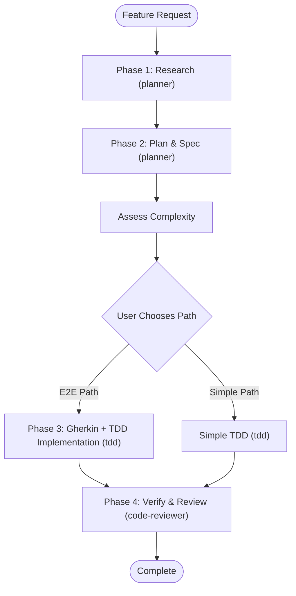

# Spec-Driven Development

Orchestrate complete outside-in development workflow from business requirements to implementation, using three agents: **planner**, **tdd**, and **code-reviewer**.

## Environment Detection

This skill works in both **Cursor** and **Claude Code**. The agent should detect the environment and adapt behavior accordingly:

**Cursor indicators**:
- `CreatePlan` tool available in system
- `.cursor/` directory exists in workspace

**Claude Code indicators**:
- Running as Claude CLI
- `CLAUDE.md` file present in workspace
- `.claude/` directory exists in workspace

**Behavior differences**:
- **Interaction mode**: This workflow may run in any mode. Do not block on plan mode.
- **Plan file creation**: In Cursor, can use `CreatePlan` tool. In Claude Code, create file directly at `docs/plans/`.
- **Skill file reading**: Use relative paths from this skill's location (`../sibling-skill/SKILL.md`) - works in both environments.

## Prerequisites Check

**CRITICAL: This workflow may run in any mode, but it must create and save the Phase 2 plan file before implementation continues.**

1. Detect the current environment (Cursor or Claude Code)
2. Confirm Phase 2 will create `docs/plans/YYYY-MM-DD-{summary}.md`
3. Proceed with the workflow

## Workflow Overview



## Agent Integration

This skill orchestrates agents defined in `agents/` (see `CLAUDE.md` for full orchestration guide):

| Phase | Agent | Role |
|-------|-------|------|
| Phase 1: Research | **planner** | Codebase exploration, requirement analysis |
| Phase 2: Plan & Spec | **planner** | User stories, acceptance criteria, plan file |
| Phase 3: Gherkin + Implementation | **tdd** | Feature files, step definitions, Red-Green-Refactor |
| Phase 4: Verify & Review | **code-reviewer** | Quality, security, performance review |

## Phase 1: Thorough Research and Discovery

**Purpose**: Conduct comprehensive research before suggesting any solutions

**Research Activities**:

1. **Codebase exploration** (explore the codebase in parallel; in Cursor: use Task tool with explore subagent):
   - Parallel exploration of different areas
   - Search for existing patterns
   - Identify relevant files and structures
   - Document existing conventions
   - Note file paths and module organization

2. **Requirement analysis**:
   - Extract user intent from request
   - Identify ambiguities
   - List missing information
   - Review recent changes (git diff, git log)

3. **Questioning phase** (ask the user clarifying questions; in Cursor: use AskQuestion tool):
   - Ask ONLY critical clarifying questions (1-2 max)
   - Never proceed with ambiguous requirements
   - Confirm scope boundaries

**Research checklist**:
- [ ] Existing feature patterns identified
- [ ] Project structure understood
- [ ] Test framework configuration verified
- [ ] All ambiguities resolved
- [ ] Scope clearly defined

**Research output format**:

## Phase 1: Research Findings

### Project Structure
- Unit Tests: `[path]`
- Integration Tests: `[path]`
- Spec Tests: `[path]`

### Existing Patterns
**Relevant Pattern** (`path/to/service.cs`):

```csharp
[relevant code snippet with context]
```

### Dependencies Identified
- Dependency 1: [Description]
- Dependency 2: [Description]

### Clarifications Needed
- Question 1: [What needs clarification]

## Phase 2: Plan & Business Specification

**Purpose**: Create business-level specifications and a concrete implementation plan

**Agent**: Use **planner** agent for requirement breakdown, user stories, and plan creation.

**Output**: Plan file at `docs/plans/YYYY-MM-DD-{summary}.md`

**Plan File Creation Timing**: Create the plan file after drafting the business spec content below, before presenting the complexity assessment to the user. The plan file is the deliverable of Phase 2.

**Contents**:
- Business context (1-2 paragraphs)
- User stories (As a/I want/So that)
- Acceptance criteria (Given/When/Then)
- User journey Mermaid flowchart (required)
- Dependencies list
- Scope definition (in/out)
- TDD task breakdown with implementation order

**Key principles**:
- Business perspective for user stories
- Concrete implementation steps in the plan
- Focus on WHAT the user needs, then HOW to build it

### Complexity Assessment Decision Point

**After spec complete, assess feature complexity:**

**E2E Path criteria** (if ANY apply):
- [ ] User-facing UI component
- [ ] Crosses multiple layers (UI → API → DB)
- [ ] Business-critical workflow
- [ ] Complex state/multi-step process
- [ ] Multiple user roles

**Simple TDD criteria** (if feature matches ANY of the following AND none of the E2E criteria apply):
- Internal/backend only
- Single layer change
- Utility function
- Bug fix
- Configuration change
- Simple CRUD

**Present to user:**

```
## Phase 2 Complete ✅

**Complexity Assessment**:
✅ Criteria met: [List]
❌ Not applicable: [List]

**My Recommendation**: [E2E Path | Simplified TDD Path]
**Rationale**: [Explanation]

**Options**:
1. E2E Path - Gherkin specs + integration-first + TDD (Phase 3)
2. Simplified TDD - Unit + integration tests only
3. Your recommendation

Which path? (Required before proceeding)
```

**STOP and wait for user confirmation**

## Path A: E2E Path (Complex Features)

### Phase 3: Gherkin + TDD Implementation

**Purpose**: Create executable acceptance tests and implement the feature using TDD

**Agent**: Use **tdd** agent for the full cycle — Gherkin file creation, step definitions, and Red-Green-Refactor implementation.

**IMPORTANT**: Follow coding standards
- Read `../test-driven-development/SKILL.md` for TDD methodology

**Step 1: Create Gherkin Feature File**

Generate → Present → Confirm → Create

Present the complete Gherkin feature file as a code block in your response. After user confirms it accurately captures requirements, create the file at the specified location.

**If user rejects the Gherkin file**:
- If the scenarios are wrong or incomplete → revise and re-present the Gherkin file
- If the underlying requirements are wrong → return to Phase 2, update the business spec and acceptance criteria, then regenerate the Gherkin file
- Do not proceed to implementation until the user explicitly confirms the Gherkin file

**Feature file structure**:
```gherkin
@FeatureName
Feature: Feature Name
    As a [role]
    I want [goal]
    So that [benefit]

Background:
    Given [common precondition]

@AC1
Scenario: Primary scenario
    Given [context]
    When [action]
    Then [expected outcome]

@AC2
Scenario Outline: Data-driven test
    When [action with "<param>"]
    Then [expected outcome]
    
    Examples:
      | param | expected |
      | val1  | result1  |
```

**Step 2: Implementation using TDD**

Follow the TDD Iron Law for each component:
1. Write failing test (RED)
2. Verify the test fails for the right reason (Verify RED)
3. Write minimal code to pass (GREEN)
4. Verify the test passes (Verify GREEN)
5. Refactor with tests as safety net (REFACTOR)
6. Verify tests still pass (Verify GREEN)
7. Commit

**Implementation Order** (bottom-up):
1. **Repository/Data Layer**: Real data access implementation
2. **Service Layer**: Business logic
3. **Controller/API Layer**: Endpoint with validation
4. **UI Layer**: Frontend component (if applicable)

**Plan Update Granularity**: Update plan file after completing each layer (Repository complete → update plan; Service complete → update plan, etc.)

## Path B: Simplified TDD (Simple Features)

**Skip Gherkin, use simplified approach:**

**Agent**: Use **tdd** agent directly for Red-Green-Refactor implementation.

**IMPORTANT**: Follow TDD methodology:
- Read `../test-driven-development/SKILL.md` for TDD methodology

**Minimum Test Coverage**:
- **Unit tests** for each public service method (business logic)
- **Integration tests** for each repository method that accesses a database
- Follow RED → GREEN → REFACTOR cycle for each test

**Implementation**:
- Write test first (RED)
- Implement minimum code to pass (GREEN)
- Refactor for quality (REFACTOR)
- No E2E tests unless specifically requested

**After completing Path B implementation, proceed directly to Phase 4 (Verification).**

## Phase 4: Verification & Review

**Purpose**: Ensure implementation meets specifications

**Verification checklist**:
- [ ] All user stories satisfied
- [ ] All acceptance criteria met
- [ ] All tests pass
- [ ] Build succeeds
- [ ] No linter errors
- [ ] Code follows standards

### Code Review Step

**Agent**: Use **code-reviewer** agent automatically.

**Before final commit, ask user:**

```
## Implementation Complete!

Would you like to review the code?

Options:
1. Yes, run code-reviewer agent now (recommended)
2. Skip review
3. I'll review myself later
```

**If user chooses review**, invoke the **code-reviewer** agent which covers:
- Security checks (CRITICAL): Hardcoded credentials, SQL injection, XSS
- Functionality validation (HIGH): Edge cases, error handling
- Code quality (HIGH): Large functions, dead code, resource management
- Performance (MEDIUM): Algorithms, caching, N+1 queries
- Best practices (MEDIUM): Naming, magic numbers, formatting

### Final Actions

1. Update plan file with verification results and mark status as "Complete"
2. Commit plan file (if requested)
3. Commit code changes (if requested)

## Critical Constraints

### Database Changes
**STOP immediately** if DB changes needed - ask user to create schema

### Build Failures
**STOP immediately** if build fails - fix before continuing

### Ambiguous Requirements
**STOP immediately** if ambiguous - ask user for clarification

## Plan File Management

**Naming**: `docs/plans/YYYY-MM-DD-{summary}.md`
- `YYYY-MM-DD`: Date the plan is created (e.g., `2026-03-03`)
- `{summary}`: Kebab-case description (e.g., `2026-03-03-clear-cart-feature.md`)

**Tracking**:
- Plan file = single source of truth during implementation
- Update immediately after each component
- Add a `Progress Log` section so execution updates are obvious and lightweight
- Mark plan status as "Complete" when all work is done

## Mermaid Requirements

**Diagrams by phase**:
- Phase 2: User journey flowchart (**required**)

**Syntax rules**:
- No spaces in node IDs (use camelCase)
- No HTML in labels
- Quote special characters in edges
- No explicit styling
- Use explicit subgraph IDs

## Agent & Skill Integration

**This skill orchestrates the following agents** (see `agents/` and `CLAUDE.md`):

| Agent | Active During | Role |
|-------|--------------|------|
| **planner** | Phase 1, Phase 2 | Research, requirement breakdown, plan creation |
| **tdd** | Phase 3, Path B | Gherkin files, step definitions, Red-Green-Refactor |
| **code-reviewer** | Phase 4 | Code quality, security, performance review |

**Compatible skills** (read for detailed methodology):
- Read `../test-driven-development/SKILL.md` for TDD implementation methodology

## Quick Reference

**E2E Path workflow** (agents in parentheses):
1. Research (planner) → 2. Plan & Spec (planner) → [Assess] → 3. Gherkin + TDD (tdd) → 4. Verify & Review (code-reviewer) → Done

**Simple TDD workflow** (agents in parentheses):
1. Research (planner) → 2. Plan & Spec (planner) → [Assess] → Simple TDD (tdd) → 4. Verify & Review (code-reviewer) → Done

**Key checkpoints** (STOP required):
- Phase 2 plan file not yet created and saved
- User path choice after Phase 2
- User confirmation of Gherkin file (Phase 3, E2E Path)
- Database changes needed
- Build failures
- Ambiguous requirements
- Code review request
