# Mermaid Diagram Guide for Spec-Driven Development

## Mandatory Diagrams by Phase

### Phase 2: Business Specification

**Required**:
- User journey flowchart showing complete user experience

**Optional**:
- System context diagram (if feature involves multiple systems)
- State diagram (if feature has distinct states)

### Phase 4: Integration-First (E2E Path)

**Required**:
- Sequence diagram showing component interactions
- Component diagram showing integration points

**Optional**:
- Data flow diagram (if data-heavy feature)

### Phase 5: ATDD Implementation

**Required**:
- Work breakdown structure (WBS) showing task hierarchy
- Dependency graph showing task relationships

## Critical Syntax Rules

### 1. No Spaces in Node IDs

Node IDs must be single words. Use camelCase, PascalCase, or underscores.

**Good**:
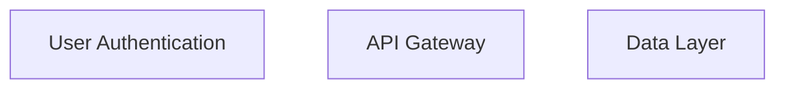

**Bad**:
```mermaid
flowchart TD
    user auth[User Authentication]  # Space in ID breaks parser
    API Gateway[API Gateway]        # Space in ID breaks parser
```

### 2. No HTML Tags in Labels

HTML tags like `<br/>` render as literal text or cause errors.

**Good**:
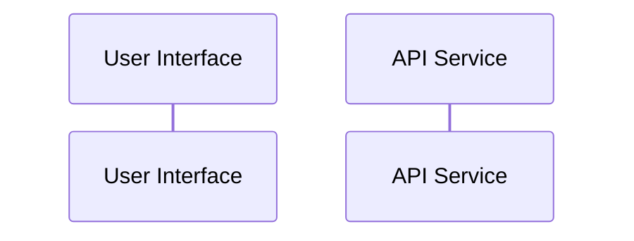

**Bad**:
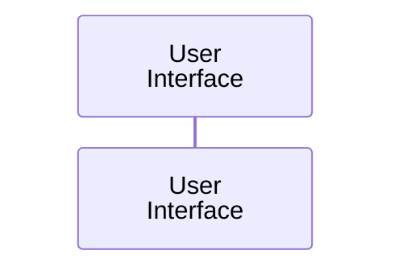

### 3. Quote Special Characters in Edge Labels

Wrap labels containing parentheses, brackets, colons in quotes.

**Good**:
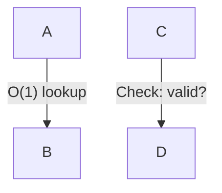

**Bad**:
```mermaid
flowchart TD
    A -->|O(1) lookup| B  # Parentheses parsed as node syntax
```

### 4. No Explicit Styling

Theme automatically applies colors. Manual styling breaks in dark mode.

**Good**:
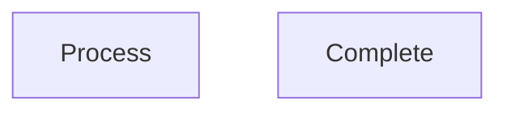

**Bad**:


### 5. Explicit Subgraph IDs

Use format: `subgraph id [Label]`

**Good**:
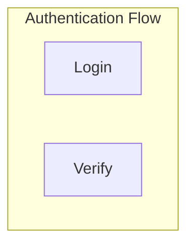

**Bad**:
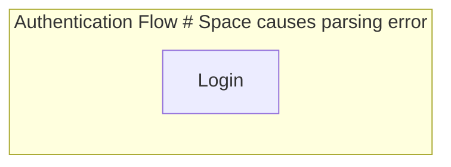

## Diagram Types and Use Cases

### Flowchart - User Journeys and Workflows

**Use for**: User experience flows, decision trees, process steps

**Example**:
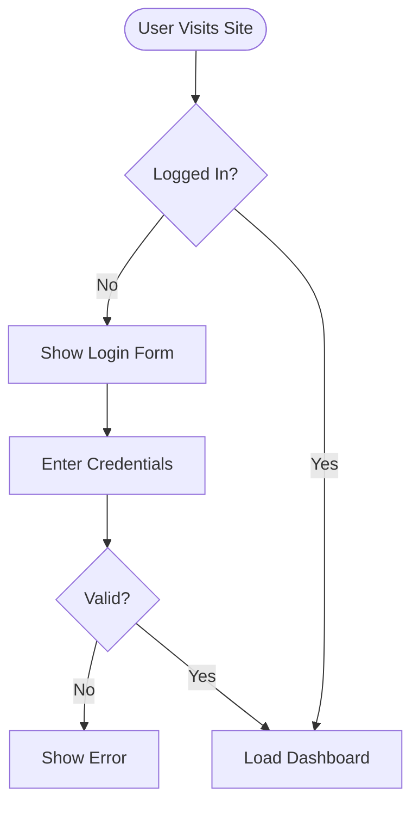

### Sequence Diagram - Component Interactions

**Use for**: API calls, service communication, integration flows

**Example**:
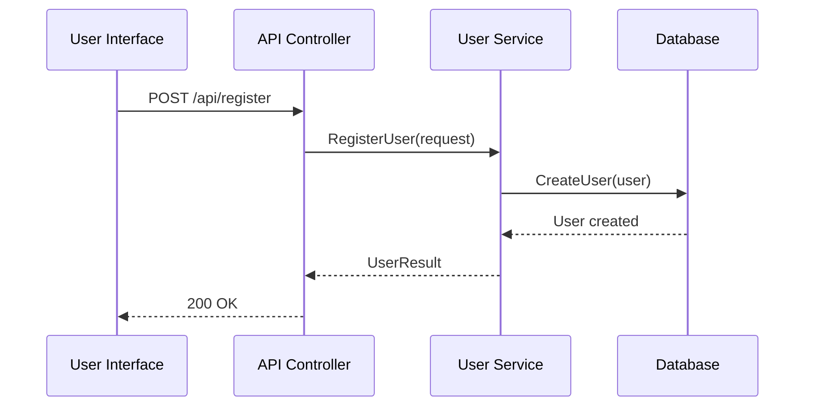

### State Diagram - State Transitions

**Use for**: Features with distinct states and transitions

**Example**:
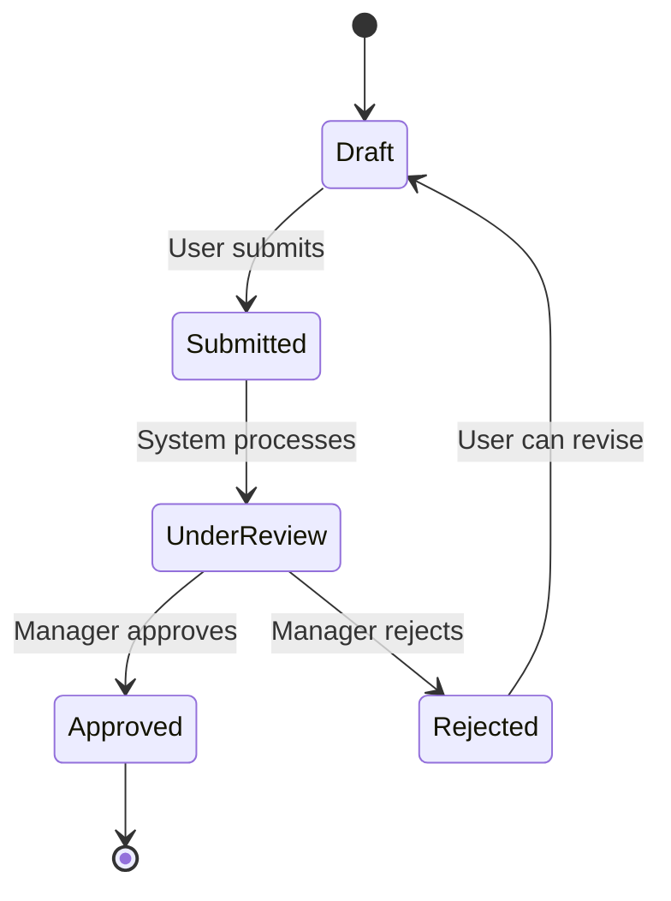

### Graph (Tree) - Work Breakdown Structure

**Use for**: Task hierarchy, component relationships

**Example**:
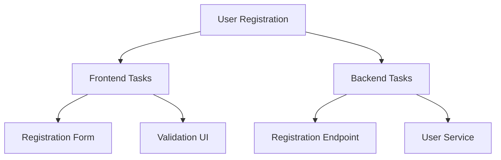

## Best Practices

### Keep Diagrams Focused

Each diagram should tell one story - don't try to show everything in one diagram.

### Use Consistent Node IDs

Pick a naming convention and stick to it: camelCase, PascalCase, or snake_case.

### Meaningful Labels

Node labels should clearly describe what the node represents.

### Align with Phase Purpose

- Phase 2: Focus on USER journey
- Phase 4: Focus on COMPONENT integration
- Phase 5: Focus on TASK breakdown
