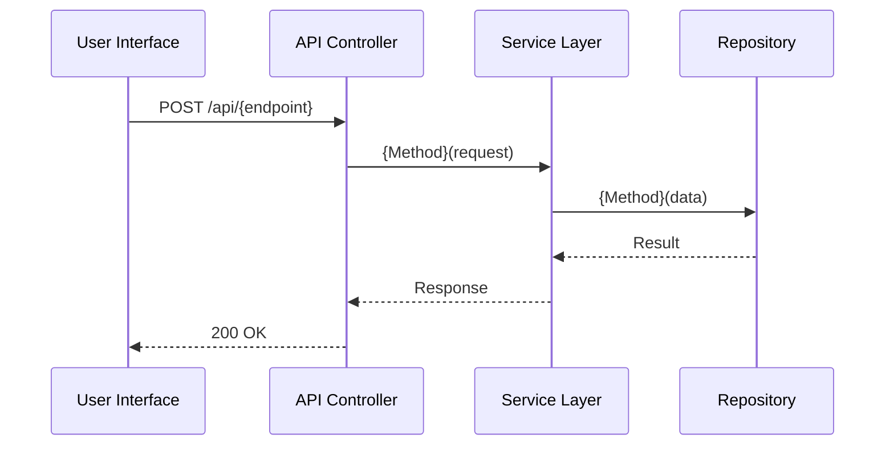

# Integration Specification Template

## Phase 4: Integration Specification

**Status**: [Complete | Skipped]
**Completed**: {timestamp}

### System Flow

### Component Integration Points

#### Frontend Components
- **Component 1**: [Purpose] - Hardcoded data: [static data spec]

#### API Endpoints
- **POST /api/{path}**: Hardcoded response: `{ "success": true }`

#### Service Layer
- **{Service}.{Method}()**: Hardcoded return: Static object

#### Repository Layer
- **{Repository}.{Method}()**: In-memory Dictionary storage

### Integration Checklist
- [ ] UI renders with hardcoded data
- [ ] UI calls API endpoints
- [ ] API returns hardcoded responses
- [ ] Services use hardcoded logic
- [ ] Repositories use in-memory storage
- [ ] Complete user journey works end-to-end

### Database Requirements (if needed)
**Tables**: [List]
**Stored Procedures**: [List]
**Action Required**: STOP - Ask user to create schema
